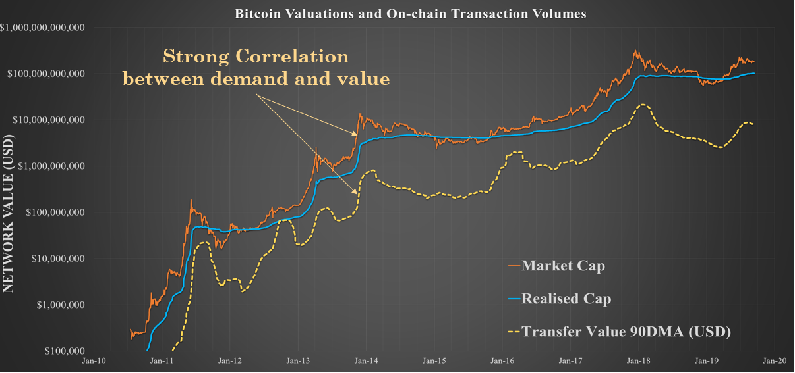
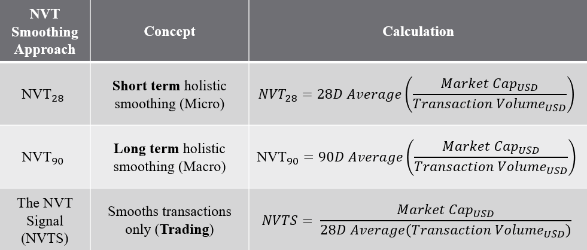
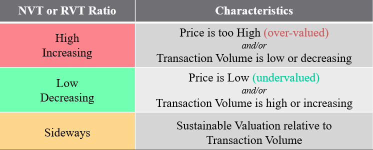
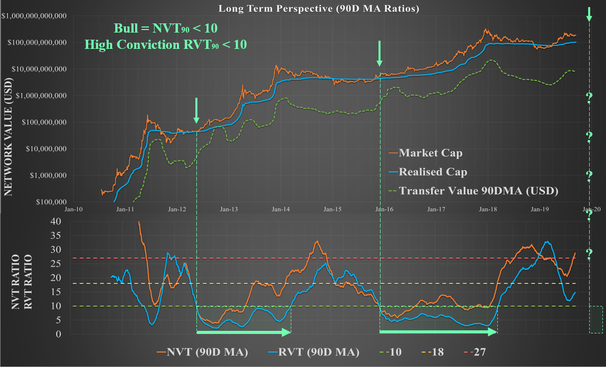
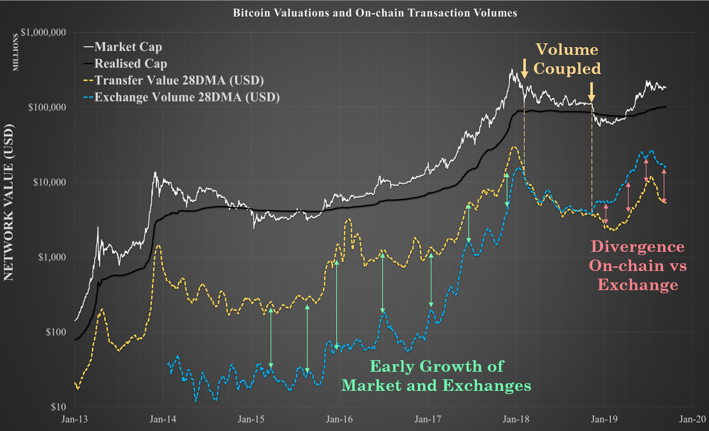
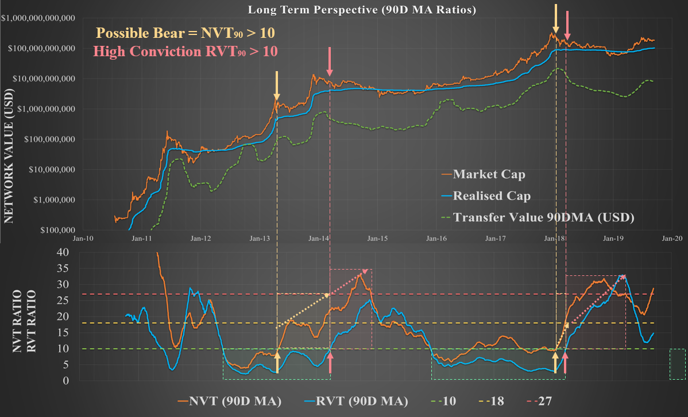
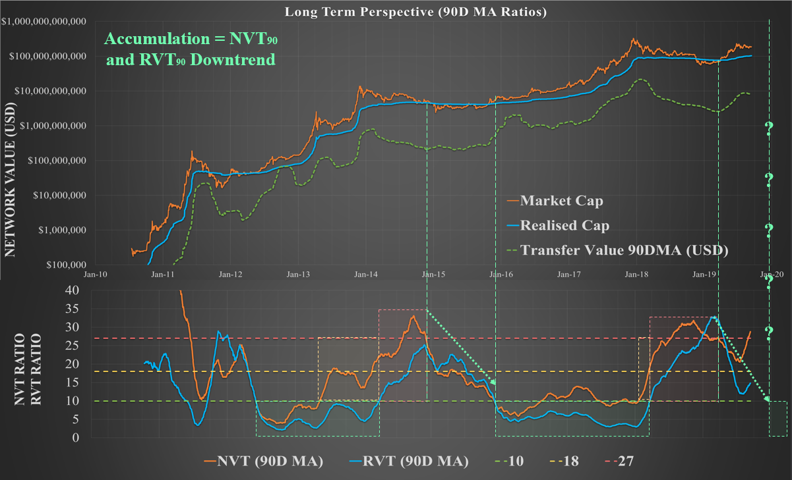

# The Bitcoin RVT Ratio, A High Conviction Macro Indicator

Bitcoin has a constantly developing suite of on-chain analysis metrics to aid traders and investors in making informed market decisions. This paper presents the **Realised Value to Transaction Ratio** (the RVT Ratio). This study is a slower but higher conviction counterpart to the **Network Value to Transaction Ratio** (the NVT Ratio) that was originally developed by [Willy Woo](https://www.forbes.com/sites/wwoo/2017/09/29/is-bitcoin-in-a-bubble-check-the-nvt-ratio/) and iterated into the NVT Signal by [Dmitry Kalichkin](https://medium.com/cryptolab/https-medium-com-kalichkin-rethinking-nvt-ratio-2cf810df0ab0). 

The NVT and RVT ratios are akin to a Price to Earnings Ratio (PE Ratio) for Bitcoin as it compares the value flowing through the network to the relevant valuation. In various forms (smoothing averages and signal), these ratios, when used in tandem, have shown to provide high conviction signals regarding Bitcoin market direction across multiple timeframes.

## Resources

**If you are new to on-chain analysis and looking for somewhere to start or prefer video format, I cover everything regarding the NVT and the RVT ratios as part the [Ready Set Crypto Bitcoin Masterclass Ep-3](https://www.youtube.com/watch?v=_Spm1c-aZmo)**.

- The NVT and RVT ratio charts are presented by Willy Woo at [woobull.com](http://charts.woobull.com/).

- All data presented in this paper is sourced from the [Coinmetrics.io community dataset](https://coinmetrics.io/charts/).

- [This chart at Coinmetrics](https://coinmetrics.io/charts/#assets=btc_zoom=1284478560000,1568764800000_formula=W1siTWFya2V0IFByaWNlIiwiUmVkIiwwLCJCVEMuUHJpY2VVU0QiXSxbIlJlYWxpc2VkIFByaWNlIiwiQmx1ZSIsMCwiQlRDLkNhcFJlYWxVU0QvQlRDLlNwbHlDdXIiXSxbIk5WVF8yOCIsIk9yYW5nZSIsMSwic21hKEJUQy5DYXBNcmt0Q3VyVVNEL0JUQy5UeFRmclZhbFVTRCwyOCkiXSxbIk5WVFMiLCJWaW9sZXQiLDEsIkJUQy5DYXBNcmt0Q3VyVVNEL3NtYShCVEMuVHhUZnJWYWxVU0QsMjgpIl0sWyJSVlRfMjgiLCJQdXJwbGUiLDEsInNtYShCVEMuQ2FwUmVhbFVTRC9CVEMuVHhUZnJWYWxVU0QsMjgpIl0sWyJSVlRTIiwiRGFya1R1cnF1b2lzZSIsMSwiQlRDLkNhcFJlYWxVU0Qvc21hKEJUQy5UeFRmclZhbFVTRCwyOCkiXV0) is setup with all NVT, RVT and Pricing models considered in this paper for readers to experiment themselves.

# Part 1 - Background to Transaction Flow Metrics
The utilisation of Bitcoin as a transfer and savings mechanism carries an on-chain signature as coins are transferred between addresses. Since we can monitor these on-chain transactions, it is possible to evaluate:

- The **Volume of BTC** that is being transferred over the network
- The **Value in USD** transferred by assigning a price at the time of the transaction

Given the fixed supply of BTC, it reasonably follows that a high or increasing demand for BTC should result in a corresponding increase to networks value (and vice-versa). Indeed this is what can be observed through the first 10 years of Bitcoin history and we can see a strong correlation between on-chain transaction flow and Bitcoin Market Valuation.

## The NVT Ratio

The **NVT ratio** provides a gauge as to whether the current demand for Bitcoin block-space justifies the present market valuation. Studying historical data we can identify periods of over or under valuation of the network via fractal signals in the NVT ratio.

The **NVT Ratio** simply calculated by dividing the Bitcoin Market Cap by the Daily On-chain Transaction Value in USD.

Since transaction flow fluctuates on a daily basis and is relatively noisy, it is advised to apply a smoothing average depending on the timescale and trading strategy employed. Some useful examples are shown in the table below.

In Summary:
- The 28 day MA is useful as a macro view over a market cycle (2-3 years)
- The 90 day MA is useful as a macro view over Bitcoin's full history
- The NVTS or RVTS takes the average of only transaction volume making it more sensitive to movements in price. Thus is it best applied as a lower timeframe trading indicator and tends to adhere to typical technical analysis patterns.

## The RVT Ratio

The **RVT Ratio** is based off the same principles as the **NVT Ratio** however utilises the **Realised Cap** rather than the **Market Cap** in the numerator. 

The [**Realised Cap**](https://coinmetrics.io/realized-capitalization/) is an on-chain metric that estimates the wealth stored in Bitcoin by valuing each UTXO at the price it was last transacted. The Realised Cap is a Bitcoin value model which represents the average cost basis of the entire market whilst also discounting lost coins.

The Realised Cap has shown to be a naturally smoother and less volatile measure of network valuation than the Market Cap as it filters out off-chain exchange volume, the lightning network and sidechain transactions. As such, both the Realised Cap and the RVT Ratio are shielded from day-to-day market sentiment, emotion and speculation that are reflected in price and Market Cap.

The RVT subsequently provides a higher conviction, albeit slower moving signal specially tuned to the macro sentiment of Bitcoin HODLers. The NVT Ratio in contrast is subject to daily price volatility and provides insight into the behaviour of daily market participants. 

One of the key strengths of the RVT ratio over the NVT is that the Realised Price itself is closer to a native on-chain native metric. As such, normalising the on-chain Realised price by on-chain volume means is more likely than the NVT to retain signal relevance into the future as the on-chain/off-chain dynamic evolves. In theory, the RVT Ratio could act as a tool for calibrating NVT fractals as more volume moves off-chain.

When used in tandem, these two ratios provide a powerful gauge of the Bitcoin demand relative to network valuation.
- The NVT provides a **noisy but fast** indicator subject to market sentiment and intra-day movements
- The RVT provides a **slower but high conviction** indicator more native to the blockchain for long term trends and calibration of the NVT

Given the natural smoothness of the realised price, it is appropriate to study the RVT Signal in most cases, taking only a relevant moving average of the transaction volumes (28D and 90D typical).

## Mental Framework for the NVT and RVT Ratios

A useful mental framework for studying these ratios is presented here.
- An NVT of 25 means every 25 days, Bitcoin transacts its entire market cap in value.
- An RVT of 10 means every 10 days, Bitcoin transacts its entire realised cap in value.
- High or increasing Ratios are a bearish fractal (Decreasing relative demand)
- Low or decreasing Ratios are a bullish fractal (Increasing relative demand)
- As more transactions move off-chain (exchanges, lightning, sidechains) the ratio levels considered 'high' or 'low' will change although the fractals in trend direction remain valid.

# Part 2 - NVT and RVT Market Fractals
By studying market history, we can determine fractals in the NVT and RVT ratio pair which present high conviction market opportunities.

In the following charts and discussions, I present horizontal levels for NVT and RVT charts of 10, 18 and 27. These values have shown historical significance for transitions in market character however are my peronal guides only and can be expected to evolve over time.

## Confirming Bull Markets

During sustainable bull markets, the value flowing through the blockchain is reasonably expected to increase both as the value of bitcoin inflates and as awareness increases for more market participants. This manifests as relatively low NVT and RVT ratio with consistent sideways trading suggesting demand growing in line with price appreciation.

The NVT and RVT have historically broken below a value of 10 at the commencement of a Bull, occuring both in early 2012 and again in late 2015. The RVT in particular has shown to sustain a value below 10 for the entirity of the 2012-13 and 2015-17 Bull markets, maintaining this value into the early Bear.

The NVT Ratio generally oscillates between a value of around 5 to 18 through bull markets in a sideways pattern and breaks into a distinctive uptrend near the blow-off top.

Key fractals confirming sustainable Bull Market conditions are:
- NVT and RVT breaking below 18 indicating increased demand for Bitcoin blockspace relative to market value.
- Strong bullish signal where the NVT and RVT break below 10. 
- Consistent sideways trading of the RVT below 10 and a rangebound NVT below 18 indicate sustainable bullish demand for blockspace with appreciating network value.

Note: Interestingly, for the early 2019 bull market, the NVT and RVT approached 18 and 10 respectively, before promptly reversing in August 2019. The mechanism behind this may be linked in part to Tether (USDT), a historically constant demand for Bitcoin block-space, [transitioning to the Ethereum blockchain](https://tether.to/usd%E2%82%AE-and-eur%E2%82%AE-now-supported-on-ethereum/) as well as dominance of off-chain leveraged speculation following the April 2019 short squeeze. 

There has been a distinct shift in volumes occuring on-chain compared to exchanges since early 2018 where exchange based volume now dominates, especially after the Dec 2017 capitulation.

There is opportunity for more diffinitive analysis on this topic as market data unfolds to assess what the mechanisms are driving this behaviour.

## Signalling Weakness in the Bull

In general, the strongest NVT and RVT signal for a weakening Bull is a transition from sideways trading into a distinct uptrend. This is driven by over-valued price (numerator) and/or under-utilisation of block-space (denominator). 

Additionally, bear markets are typically characterised by a dominance in off-chain exchange based trade volume rather than on-chain transactions which further drives a reduction in the NVT and RVT denominator (increasing the ratio).  
Naturally, the NVT will react first to market tops given its sensitivity to price however at the cost of more noise and more false signals (as seen in early 2013 where it triggered above a value of 10 early). The RVT provides a slower but higher conviction signal to confirm this transition to Bear market conditions on a clean break above 10.

As such, the NVT can provide early warning of over-valuation and/or reduced demand for transactions which can be confirmed by a similar weakening in the RVT.

Key fractals of market topping and bear conditions are:
- The NVT breaks convincingly upwards from the 5 to 18 range signaling market valuation is beginning to exceed transaction utility. 
- Early warning of bearish conditions on NVT break above 10.
- Confirmation of bearish conditions on RVT break above 10.

## Capitulation and Accumulation

The capitulation and accumulation phase at the end of Bear markets have two key mechanisms at play; 
1. Weak hands puking out assets. 
2. Heavier investment by smart money.

During the final capitulation, a high volume of sellers transact on-chain seeking an exit. Smart money accumulation then commences, particularly as market price dips below the realised price, leading to large value transactions relative to the deflated network valuation.

This has shown to trigger a reversal of the NVT and RVT ratios into a downtrend until such time that a sustainable bull is back in effect.

Key fractals of the capitulation and accumulation phase are:
- Capitulation generally occurs following NVT and RVT ratios reaching high values (above 18 to 27) suggesting the network is heavily under-utilised (disgust phase).
- A strong downtrend in the NVT and RVT ratio suggests a change in market character due to the combination of depressed prices, weak hands selling and smart money accumulating.
- The steeper the downtrends in the NVT and RVT, the more bullish the signal.

# Concluding Remarks

Bitcoin is optimised for securely transferring value. The NVT and RVT ratios offer insight to the network valuation normalised against demand for blockspace. Given the fixed supply of bitcoins, increases and decreases in demand for block-space have shown to have a corresponding effect on the macro market trends.

The NVT and RVT ratios are best applied in tandem as a fast/noisy and slow/convincing signal pair. A summary of key metrics useful to the typical Bitcoin HODLer are presented in the table below for future reference.

## Limitations and Notes on the Future

The NVT and RVT Ratios rely on on-chain transactions and as the Bitcoin market continues it's exponential evolution, volumes occuring on-chain will similarly evolve over time.

Volume will continue to move off-chain to layer 2 solutions like Lightning Network, sidechains and third party 'crypto banks', exchanges and custodians. As such, the fractals and key levels discussed will likely evolve over time with these shifts in demand.

As noted, the RVT and Realised Cap will likely be more resistant to obselecence in comparison to the NVT as they are more closely native to the chain. I expect the RVT fractals will continue to provide a reasonable fractal benchmark against which the NVT can be recalibrated over time.

## Disclaimer
Nothing contained in this article shall be considered as investment or trading advice.

## Signature

**Bitcoin**

>

>[3Eqob76zToeKf2m9JYg3Z9ZUWSVsySRewZ](https://blockstream.info/address/3Eqob76zToeKf2m9JYg3Z9ZUWSVsySRewZ)

**Decred**
>

>[Dskryq1zhgXBBx5Qw8fnV588iSYeY7d6JY3](https://explorer.dcrdata.org/address/Dskryq1zhgXBBx5Qw8fnV588iSYeY7d6JY3)

>Signed Message (Article Title): H9rQB6Xzh9rIpw7F4KyvZMxHaAc4EekSZaHl3XtBPwv5PkI5v0fAv85w11ez2SYHpXMK3h8oh3N4nuhJ2bE6jRM=

## Aknowledgements
A huge thanks to Doc, Mav and the whole community at [ReadySetCrypto](readysetcrypto.com) for exploring these ideas as it happened.

## References

[1] Willy Woo – [Is Bitcoin in a Bubble? Check the NVT Ratio](https://www.forbes.com/sites/wwoo/2017/09/29/is-bitcoin-in-a-bubble-check-the-nvt-ratio/), 2017

[2] Dmitry Kalichkin – [Rethinking Network Value to Transactions (NVT) Ratio](https://medium.com/cryptolab/https-medium-com-kalichkin-rethinking-nvt-ratio-2cf810df0ab0), 2018

[3] Brian Quinlivan – [The NVT Ratio](https://www.forbes.com/sites/wwoo/2017/09/29/is-bitcoin-in-a-bubble-check-the-nvt-ratio/), 2018

[4] Cryptopoiesis – [Brief Observations and questions on the Lightning Network’s effect on NVT Ratio](https://blog.goodaudience.com/brief-observations-and-questions-on-the-lightning-networks-effect-bitcoin-s-nvt-ratio-3beb4bd61f1f), 2018

[5] Norupp – [NVT Ratio and NVT Signal – Detect Bitcoin Bubbles](https://www.norupp.com/nvt-ratio-and-nvt-signal-ratio-detect-bitcoin-bubbles/), 2019
