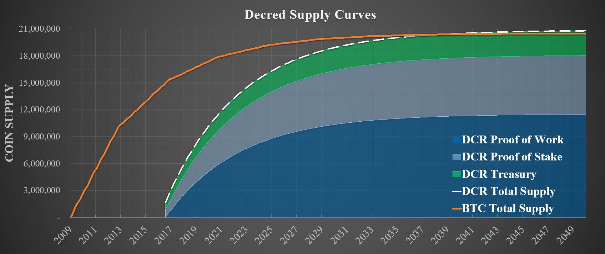

# Decred, following in Bitcoin's Footsteps
In my opinion, **Decred** is one of the most promising cryptocurrency projects in the industry and a sound competitor with **Bitcoin** in the free market for digital money. 

I previously explored a [comparison between Alt-coins and **Bitcoin**](https://medium.com/@_Checkmatey_/monetary-premiums-can-altcoins-compete-with-bitcoin-54c97a92c6d4) in regards to their Monetary Premiums considering a simple methodology relating scarcity, as measured by stock-to-flow ratio, to market value inspired by a methodology proposed by [Plan B](https://medium.com/@100trillionUSD/modeling-bitcoins-value-with-scarcity-91fa0fc03e25) for **Bitcoin**). This study established the existence of a fundamental power law relationship for **Bitcoin** that acts as a valuable baseline against which fixed supply cryptoassets may be compared. 

An outcome of my study was an observation that **Decred** has developed and maintained a convincing monetary premium. Not only is Decreds monetary premium more convincing than that of all competing alt-coins considered, but in fact even more so than **Bitcoin** in its early days.

What I explore further in this article, is the depth to which **Decred's** market valuation and performance to date is comparable to that of **Bitcoin** in its early history. An apples to apples comparison.

# Why Decred?
**Decred** is founded on the same core sound money principles as **Bitcoin** yet differentiates significantly in three very meaningful ways, namely:

1. **Decred's Security** and consensus utilises an innovative and elegant Hybrid PoW/PoS mechanism. This system can reasonably provide superior [ledger assurances](https://medium.com/@permabullnino/introduction-to-crypto-accounting-an-analysis-of-decred-as-an-accounting-system-4d3e67fce28?source=search_post---------2) (Permabull Nino, 2019) and a higher cost of attack (between 20x and 40x) per unit of market capitalisation in comparison to **Bitcoin** ([Zubair Zia, 2018]((https://medium.com/decred/decreds-hybrid-protocol-a-superior-deterrent-to-majority-attacks-9421bf486292)) and [Fiach_Dubh, 2019](https://medium.com/coinmonks/comparing-double-spend-resistance-decred-vs-bitcoin-part-1-330c8081b2a9)).

2. **Pre-established Governance Mechanism** that allocates decision making capacity and risk ownership to DCR holders. The governance system is comprised of off-chain signaling via [Politeia](https://proposals.decred.org), social media channels (Matrix, Twitter, Reddit etc.) and binding on-chain voting for consensus level changes via the **Decred** ticket system. Decred governance is underpinned by a remarkably strong [social contract](https://medium.com/@NoahPierau/unpacking-decreds-social-contract-69c413aa652) (Haon, 2019) that to date has proven its capacity for retaining community integity and mindshare.

3. **Distribution of block rewards** allocated as 60% to Proof-of-work miners in return for CAPEX and OPEX costs, 30% to DCR ticket holders to incentivise governance participation and security and a final 10% to the **Decred** Treasury which is owned ([and soon to be operated by](https://proposals.decred.org/proposals/c96290a2478d0a1916284438ea2c59a1215fe768a87648d04d45f6b7ecb82c3f)) **Decred** stakeholders. Decred effectively incentivises participation of Miners, Stakeholders and Builders in contrast to **Bitcoin's** 100% allocation to Proof-of-Work Miners.

In this light, **Decred** has a uniquely differentiated value proposition amongst the landscape of crypto-assets and represents a strong candidate for a long-term digital monetary asset. As such, **Decred** represents a valuable opportunity to study the early age performance of a strong contender for digital money with the benefit of **Bitcoin** hindsight.

# Comparative Study

These sections compare the performance of **Decred** and **Bitcoin** across the following key value metrics:

1. Monetary policy
2. Cost of Security
2. Scarcity and Unforgeable Costliness

## Monetary Policy

The core value proposition of **Decred** is near identical to **Bitcoin** in that it presents an opt-in, self-sovereign and immutable digital store of value.

**Decred** has thus retained the core sound money principles of **Bitcoin** including:
- 21 million maximum unit supply of DCR
- 100,000,000 divisible units (atoms) per DCR, equivalent to satoshis of Bitcoin
- Deterministic supply schedule by block height

Decred's overall supply curve actually approaches that of **Bitcoin** with near identical circulating supply estimated around Mar 2038 (Bitcoin Block 1,534,712 ~ Decred Block 2,272,240).

Material differences between **Decred** and **Bitcoin** monetary policies can be summarised as:
- Decred launched with an 8% premine (1.68 million DCR) with 4% airdropped free to early community members and 4% purchased by the team at a rate of $0.50/DCR. Bitcoin launched without a pre-mine however it's existence was initially known only to a small collective of cypherpunks with an estimated 1 million BTC still held by Satoshi Nakamoto.

- The **Decred** block reward starts at 31.19582664 DCR per ~5min block time and the reward is distributed at a rate of 60% / 30% / 10% to Proof-of-Work miners, Proof-of-Stake Stakeholders and the **Decred** Treasury Fund, respectively. This compares to **Bitcoin** that starts at 50 BTC per block issued every ~10mins allocated in full to Proof-of-Work miners.

- **Decred's** monetary policy does not include a significant supply shock 'halving' event as **Bitcoin** does every 210,000 blocks (~4 years). Instead, its block reward follows a smooth reduction by [100/101 every 6,144 blocks](https://docs.decred.org/advanced/inflation/), equating to a reduction of approximately 0.99% to the total block reward every 21.33days.

To illustrate the similarity between monetary policies, we can superimpose **Decred** launching at the block-height when **Bitcoins** circulating supply reached 1.68million BTC (equivalent to **Decreds** initial pre-mine) to compare progression of the stock-to-flow ratios and supply curves.

What is immediately observable is that **Decreds** stock-to-flow development approximates the mean trajectory of **Bitcoin** and traverse the same set of stock-to-flow values.

As such, if the fundamental relationship between stock-to-flow and value developed by Plan B is proven valid only for Bitcoin, it must be reasonably attributed to the combined influence of Satoshi's immaculate conception, first mover advantage and halving events.

## Differences in Market Landscape

The **Decred** protocol does not benefit from discrete viral hype cycles observed throughout **Bitcoin's** history following halving supply shocks. Similarly, **Decred** competes amongst a growing pool of alt-coins for capital and market mind-share making for a more competitive landscape than Bitcoin faced in the early days.

On the other hand, **Decred** (and other alt-coins) benefit from the prior knowledge and a larger pool of participants in the cryptocurrency market than **Bitcoin** with roots nurtured by a small collective of cyperpunks into maturity. 

Given extensive market competition, a lack of viral supply shocks and famously minimal social media presence of the founding **Decred** team, any observable growth of **Decred** in it's formative years can most likely be attribted to the communities belief in the fundamental value proposition.

As was observed [in this study](https://medium.com/@_Checkmatey_/monetary-premiums-can-altcoins-compete-with-bitcoin-54c97a92c6d4), 

