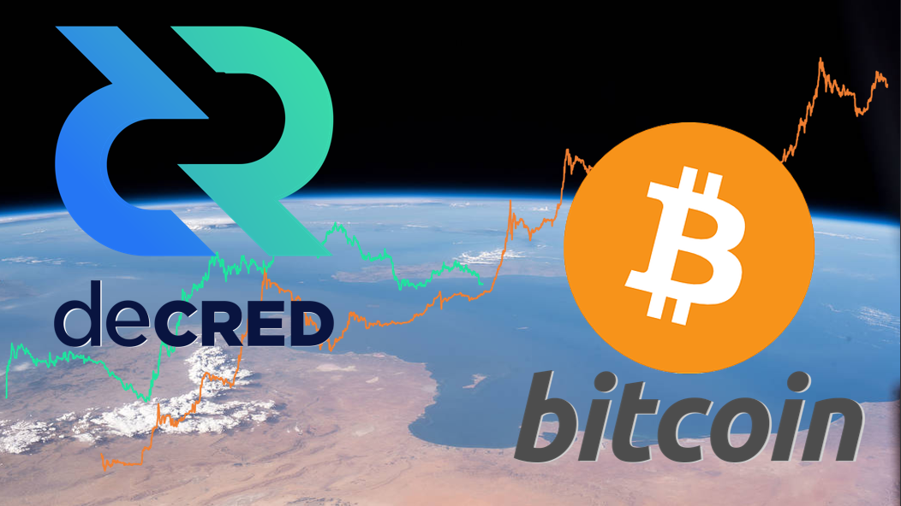
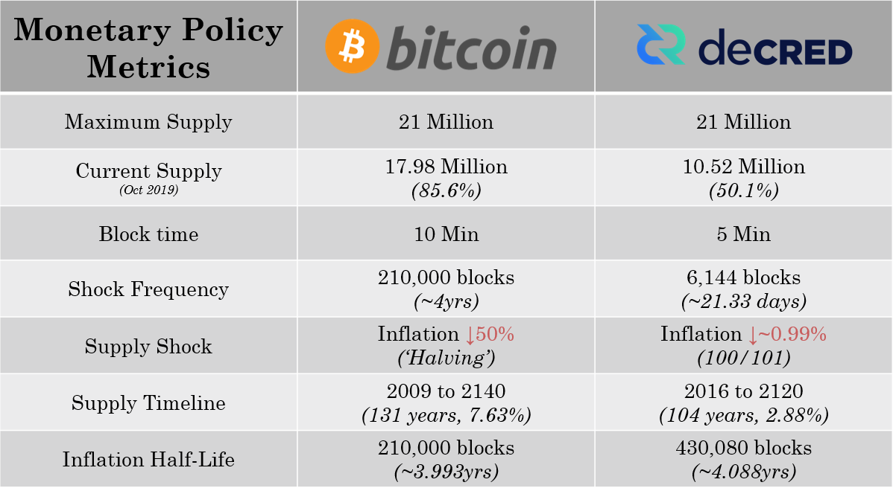
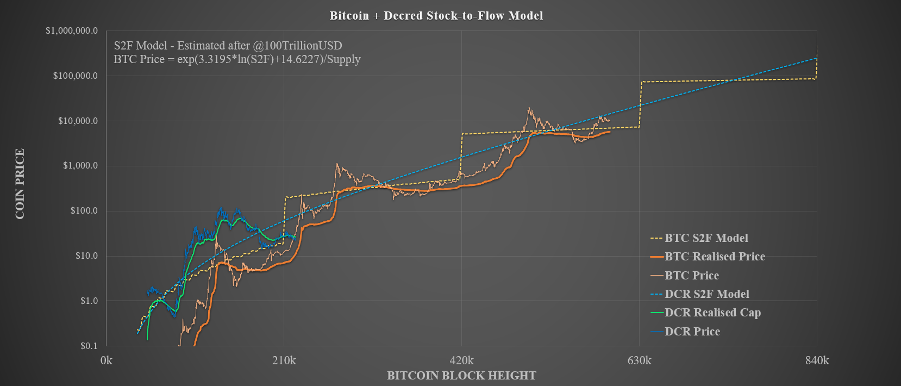

# Decred, following in Bitcoin's Footsteps
*by Checkmate*

*14-Oct-2019*

In my opinion, **Decred** is the most promising cryptocurrency project and a sound competitor next to **Bitcoin** in the free market for digital and scarce monetary assets. At an absolute mininimum, strong market competition market forces innovation and hardening of the strongest protocols whilst also providing a rational risk hedge during the nascent development of digital mony.

As **Bitcoin**  continues to assert it's market dominance, it is the correct benchmark against which competitors must be compared. The following article is the first of three parts and the culmination of a number of months study into **Decred** from a data driven, first principles perspective.

This is the first of three papers to compare the performance of **Decred** and **Bitcoin** across the following key value metrics:

1. Monetary policy and Scarcity
2. Cost of Security and Unforgeable Costliness
3. Governance, User Adoption and Resilience

# Background

Previously I explored a [comparison between Alt-coins and **Bitcoin**](https://medium.com/@_Checkmatey_/monetary-premiums-can-altcoins-compete-with-bitcoin-54c97a92c6d4) in regards to their Monetary Premiums. This study considered a simple methodology relating scarcity, as measured by stock-to-flow ratio, to market value inspired the work of [Plan B](https://medium.com/@100trillionUSD/modeling-bitcoins-value-with-scarcity-91fa0fc03e25) for **Bitcoin**). This study established the existence of a fundamental power law relationship for **Bitcoin** that acts as a valuable baseline against which fixed supply cryptoassets may be compared.

A key outcome of this paper was the observation that **Decred** has developed and maintained a convincing monetary premium well in excess of the other alt-coins considered, but in fact even more so than **Bitcoin** in its early days. As such, it appears appropriate to continue this study to quantify the validity of the observation.

What I explore further in this article, is the depth to which **Decred's** market valuation and performance to date is comparable to that of **Bitcoin** in its early history. An apples to apples comparison.

## Disclosure

*This paper was written and researched as part of an [accepted research proposal](https://proposals.decred.org/proposals/78b50f218106f5de40f9bd7f604b048da168f2afbec32c8662722b70d62e4d36) by the Decred DAO and thus the writter was paid in DCR for their time undertaking the research. Nevertheless, this study aims to be a factual study based on publicly available market and blockchain data. All findings may be readily verified by readers and all assumptions shall be clearly stated.*

# Why Decred?
**Decred** is founded on the same core sound money principles as **Bitcoin** yet differentiates significantly in three very meaningful ways, namely:

1. **Decred's Security** and consensus utilises an innovative and elegant Hybrid PoW/PoS mechanism. This system can reasonably provide superior [ledger assurances](https://medium.com/@permabullnino/introduction-to-crypto-accounting-an-analysis-of-decred-as-an-accounting-system-4d3e67fce28?source=search_post---------2) (Permabull Nino, 2019) and a higher cost of attack (between 20x and 40x) per unit of market capitalisation when compared to **Bitcoin** ([Zubair Zia, 2018]((https://medium.com/decred/decreds-hybrid-protocol-a-superior-deterrent-to-majority-attacks-9421bf486292)) and [Fiach_Dubh, 2019](https://medium.com/coinmonks/comparing-double-spend-resistance-decred-vs-bitcoin-part-1-330c8081b2a9)).

2. **Pre-established Governance Mechanism** which allocates decision making capacity and risk ownership to DCR holders. The governance system is comprised of off-chain signaling via [Politeia](https://proposals.decred.org), social media channels (Matrix, Twitter, Reddit etc.) and binding on-chain voting for consensus level changes via the **Decred** ticket system. Decred governance is underpinned by the [Decred constitution](https://docs.decred.org/governance/decred-constitution/) coupled with a remarkably strong [social contract](https://medium.com/@NoahPierau/unpacking-decreds-social-contract-69c413aa652) (Haon, 2019) that to date has proven its capacity for retaining community integity and mindshare. The **Decred** governance mechanism enables efficient yet distributed coordination for implimenting protocol upgrades and mitigate future risks.

3. **Distribution of block rewards** allocated as 60% to Proof-of-work miners in return for CAPEX and OPEX costs, 30% to DCR ticket holders to incentivise governance participation and security and the final 10% to the **Decred** Treasury which is owned ([and soon to be operated by](https://proposals.decred.org/proposals/c96290a2478d0a1916284438ea2c59a1215fe768a87648d04d45f6b7ecb82c3f)) **Decred** stakeholders. Decred effectively incentivises participation of Miners, Stakeholders and Builders in contrast to **Bitcoin's** 100% allocation to Proof-of-Work Miners. This makes the Decred protocol one of the largest operational decentralised autonomous organisations with over [646,275 DCR ($10.34M)](https://explorer.dcrdata.org/address/Dcur2mcGjmENx4DhNqDctW5wJCVyT3Qeqkx?chart=balance&zoom=ijhhasg0-k1st3q80&bin=month&txntype=merged_debit) in assets stored in the Treasury at the time of writing.

In this light, **Decred** has a uniquely differentiated value proposition amongst the landscape of crypto-assets and represents a strong digital monetary store of value candidate.

**Decred** thus presents a valuable opportunity to study the early age performance of a contender for digital money with the benefit of **Bitcoin** hindsight.

# Part 1 - Monetary Policy

The core value proposition of **Decred** is near identical to **Bitcoin** in that it presents an opt-in, self-sovereign and immutable digital store of value.

**Decred** has thus retained the core sound money principles of **Bitcoin** including:
- 21 million maximum unit supply of DCR
- 100,000,000 divisible units (atoms) per DCR, equivalent to satoshis of Bitcoin
- Deterministic supply schedule by block height

Decred's overall supply curve actually approaches that of **Bitcoin** with near identical circulating supply estimated around Mar 2038 (Bitcoin Block 1,534,712 ~ Decred Block 2,272,240).

Material differences between **Decred** and **Bitcoin** monetary policies can be summarised as:
- Decred launched with an 8% premine (1.68 million DCR) with half (864k DCR) airdropped free to early community members and the other half purchased by the team at a rate of $0.49/DCR. Bitcoin launched without a pre-mine and instead had the benefit only a small collective of cypherpunks being aware if it's existence to support the network in this nascent stage. Within the first year it is estimated that Satoshi Nakamoto was the dominant miner who still owns an estimated lower bound of 700k to 800k BTC ([BitMex, 2018](https://blog.bitmex.com/satoshis-1-million-bitcoin/); [Held, 2018](https://blog.picks.co/bitcoins-distribution-was-fair-e2ef7bbbc892)).

- The **Decred** block reward starts at 31.19582664 DCR per ~5min block time and the reward is distributed at a rate of 60% / 30% / 10% to Proof-of-Work miners, Proof-of-Stake Stakeholders and the **Decred** Treasury Fund, respectively. This compares to **Bitcoin** that starts at 50 BTC per block issued every ~10mins allocated in full to Proof-of-Work miners.

- **Decred's** monetary policy does not include a significant supply shock 'halving' event as **Bitcoin** does every 210,000 blocks (~4 years). Instead, its block reward follows a smooth reduction by [100/101 every 6,144 blocks](https://docs.decred.org/advanced/inflation/), equating to a reduction of approximately 0.99% to the total block reward every 21.33days.

To illustrate the similarity between monetary policies, we can superimpose **Decred** launching at the block-height when **Bitcoins** circulating supply reached 1.68million BTC (equivalent to **Decreds** initial pre-mine) to compare progression of the stock-to-flow ratios and supply curves.

What is immediately observable is that **Decreds** stock-to-flow development approximates the mean trajectory of **Bitcoin** and traverse the same set of stock-to-flow values.

As such, if the fundamental relationship between stock-to-flow and value developed by Plan B is proven valid only for Bitcoin, it must be reasonably attributed to the combined influence of Satoshi's immaculate conception, first mover advantage and halving events.

## Differences in Market Landscape

The **Decred** protocol does not benefit from discrete viral hype cycles observed throughout **Bitcoin's** history following halving supply shocks. Similarly, **Decred** competes amongst a growing pool of alt-coins for capital and market mind-share making for a more competitive landscape than Bitcoin faced in the early days.

On the other hand, **Decred** (and other alt-coins) benefit from the prior knowledge and a larger pool of participants in the cryptocurrency market than **Bitcoin** with roots nurtured by a small collective of cyperpunks into maturity. 

Given extensive market competition, a lack of viral supply shocks and famously minimal social media presence of the founding **Decred** team, any observable growth of **Decred** in it's formative years can most likely be attribted to the communities belief in the fundamental value proposition.

As was observed [in this study](https://medium.com/@_Checkmatey_/monetary-premiums-can-altcoins-compete-with-bitcoin-54c97a92c6d4), 

