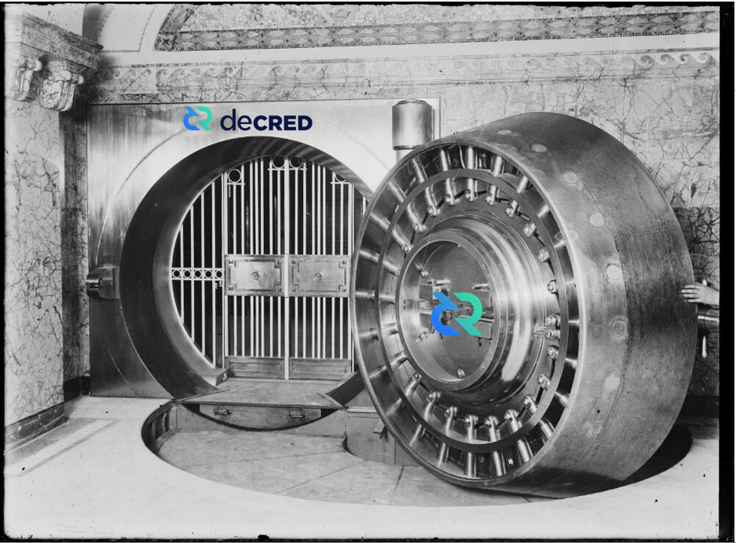
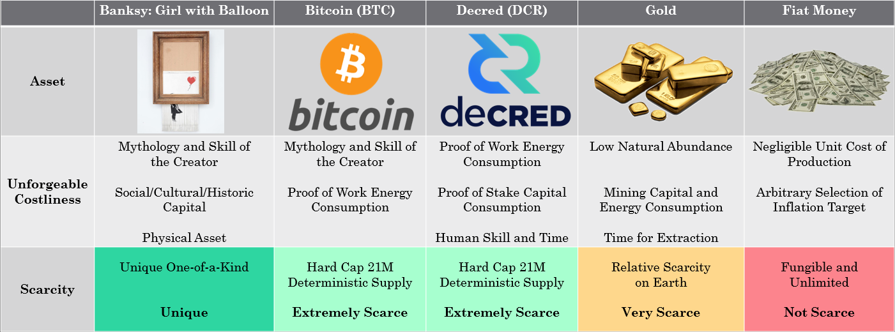
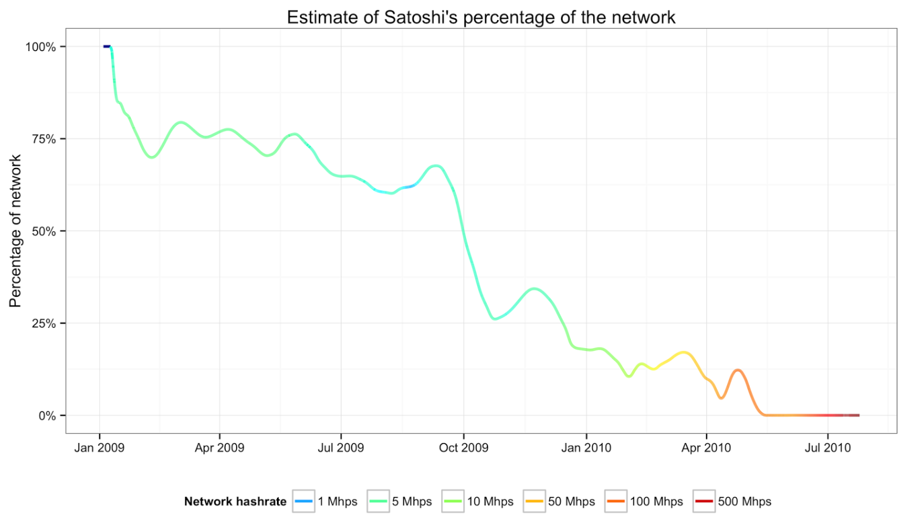
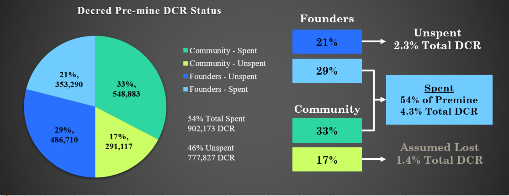
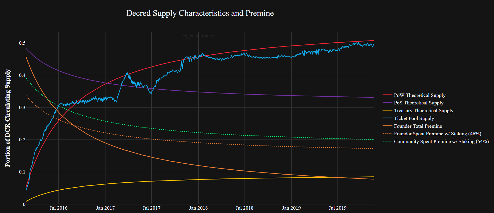

# Decred, Hypersecure and Unforgeably Scarce
*by Checkmate*

*14-Oct-2019*

**Decred** is one of the most promising cryptocurrency projects and a sound competitor next to **Bitcoin** in the free market for scarce digital money. At a minimum, strong market competition forces innovation and hardening of the strongest protocols whilst also providing a rational hedge for risk during the nascent development of digital money.

As **Bitcoin**  continues to assert it's market dominance, it is the correct benchmark against which competitors must be compared. The following article is the second of a three part study into **Decred** from a data driven and first principles perspective. The series aims to critically compare the performance of both **Decred** and **Bitcoin** across the following value metrics:

1. [Monetary policy and Scarcity](https://medium.com/@_Checkmatey_/monetary-premiums-can-altcoins-compete-with-bitcoin-54c97a92c6d4)
2. Cost of Security and Unforgeable Costliness (this paper)
3. Governance, User Adoption and Resilience

# Background

In [Part 1 of this series](https://medium.com/@_Checkmatey_/monetary-premiums-can-altcoins-compete-with-bitcoin-54c97a92c6d4), I established that a convincing relationship exists between **Decred's** scarcity, measured by stock-to-flow ratio, and its market valuation. The linear regression analysis suggests that there is an underlying demand for DCR which is of remarkably similar conviction to that for BTC during it's formative years.

In fact the correlations between **Decred** and **Bitcoin** at an equivalent age of 3.67 years are so strong that additional work is required to establish the depth to which **Decred** is following in **Bitcoin's** footsteps.

In this paper, I explore the **Security and Consensus** mechanisms of **Decred** and **Bitcoin** to quantify the unforgeable costliness of coin production. The immutability and resistance of these protocols to monopolistic capture is the core value proposition which enables the separation of money and state. As such, quantifying the performance and security budgets will provide confidence for people who chose to securely store their wealth in BTC or DCR, potentially for thousands of years to come.

## Disclosure

*This paper was written and researched as part of the author's [research proposal](https://proposals.decred.org/proposals/78b50f218106f5de40f9bd7f604b048da168f2afbec32c8662722b70d62e4d36) accepted by the Decred DAO. Thus, the writer was paid in DCR for their billed time undertaking the research. Nevertheless, the study aims to be objective and mathematically rigorous based on publicly available market and blockchain data. All findings can be readily verified by readers in the attached [spreadsheet]() and all assumptions shall be clearly stated.*

# ***UPDATE SPREADSHEET LINK***

# Part 2 - Unforgeable Costliness

An essential characteristic of a digital sound money protocol is **Unforgeable Costliness**, that is the impossability of producing the asset without a provable expendature of capital, energy and/or time. Unforgeable Costliness stipulates that one of these scarce resources must be exchanged for production of another (capital being an abstraction of both energy and time). Without it, production may be gamed by those with greater access to the source, subsequently destroying the confidence and trust in future expectations of inflation.

Nick Szabo beautifully articulated the idea by describing the unavoidable and expensive costs of production which must exist for an asset to attain a monetary premium.

> "What do antiques, time, and gold have in common? They are costly, due either to their original cost or the improbability of their history , and it is difficult to spoof this costliness” Nick Szabo (2008)

>"Precious metals and collectibles have an unforgeable scarcity due to the costliness of their creation. This once provided money the value of which was largely independent of any trusted third party” Nick Szabo (2005)

Notable Examples of unforgeable costliness and the impact on relative scarcity are presented in the following table with the scarcest assets, that reliably store value over time, having a consistent feature set:

1. **Improbability of existence** due to mythology and skill of the creator, a low natural abundance or a hard coded fixed supply.
2. **Requirement for expenditure  of capital, energy and time** during production in the form of physical mining, Proof-of-Work, capital expenditure  and human effort
3. **Soundness and resistance to arbitrary future inflation** and monopolistic capture due to the difficulty of production and/or counterfeiting.

The remainder of this paper will explore the ***Unforgeable Costliness*** of **Bitcoin** and **Decred** as a gauge on relative scarcity considering this metric. By quantifying the costs associated with each mechanism of coin production, we an form a thesis around the security and resilience of the system to uphold the codified scarcity.

The unforgeable costliness will be explored in the following areas:

1. Cost of Creation
2. Cost of Energy
3. Cost of Capital
4. Cost of Time

## The Cost of Creation

**Gold**, due to it's atomic properties is of extremely low abundance relative to other commodities. It's existence and supply is a product of the laws of physics and thus may only be acquired via physical exploration and extraction or by purchasing it off the market. This manifests as a natural constraint on supply inflation given the demands of production and lead to a global convergence on gold as the monetary base throughout human history.

Industrial uses represent a small fraction of global demand and it is a reasonable conclusion that gold's intrinsic scarcity and monetary premium underlies demand for jewelry, rather than the other way around.

Scarce digital assets like **Bitcoin** and **Decred** differ to gold in that they are man-made and thus have a discrete, designed genesis event. Given that the incentive to secure these protocols relies on the demand for the scarce native units (BTC and DCR), the initial distribution mechanism must be carefully designed to incentivise protection of the protocol during early life.

It is important to appreciate the characteristics of the initial distribution for a man-made scarce asset as it carries risk of unfair leverage granted to the creators. Establishing user trust in a money protocol requires great finesse and skill in design, and thus the cost of creation must be the subject of user critique.

### Bitcoin

For **Bitcoin**, Satoshi Nakamoto's design decision was to transparently release the Bitcoin whitepaper on 31 Oct 2018 and the v0.1 Bitcoin and mining code on 9 Jan 2009 to the cypherpunks public email list. This group of people were those most likely to engage with and nurture the project through it's formative and most vulnerable years.

Numerous studies into early hashrate indicate Satoshi was the dominant miner through the first year with estimates on the number of bitcoins mined ranging from 740k to 980k BTC (of which all are believed to have never been spent). Given there is no way to tell if these coins will ever move, public consensus appears to have accepted this uncertainty as a fair and reasonable thanks for Satoshi's skill and time ([1],[2],[3],[4],[5]).

The evidence strongly suggests Satoshi deliberately reduced his share of network hashrate over time as new miners entered and the Bitcoin network gained strength. Thus **Bitcoin's** genesis is considered by many to be as fair as a decentralised scarce asset network launch could be.

Key ingredients in **Bitcoin's** initial distribution may be reasonably summarised as follows:
1. Complete transparency months in advance of releasing the code.
2. Permissionless access with appropriate mining tools made available on launch.
3. Awareness raised of those people most likely to nurture the protocol through its most vulnerable early years.
4. Appropriately gradual reduction in the role of the founder.
5. A now formed public consensus that the founder owning around 4% of BTC supply is fair remuneration for their work (value of time and skill).

### Decred

**Decred** launched on 8 Feb 2016 at which time the cryptocurrency market had reached an elevated state of maturity. **Bitcoin** had attained a market valuation over $6 billion and the market had significantly more participants and eyes (of friends and foes) than at the time of **Bitcoin's** launch. On one hand, these market conditions can benefit coin price appreciation and attraction of miners whilst on the other pose challenges for bootstrapping security without compromising a 'fair initial distribution'.

An important feature of **Decred** is it's Hybrid PoW/PoS security and consensus mechanism. In order to secure the chain at launch, it was necessary that a majority of honest actors, with an appreciation of the project's philosophy, participate in the PoS ticket system.

For **Decred**, Company 0's design decision was to launch the protocol with a pre-mine totaling 1.68M DCR, equivalent to 8% of the total 21M supply. Half of the pre-mine (4%, 840k DCR) was airdropped free to community members to bootstrap the Proof-of-Stake security and governance. The other half was  purchased by the founding team at a rate of $0.49/DCR either in exchange for their own money or their future development time.

Community registration to participate in the airdrop was transparently publicised one month prior to the window closing. Applications were open and over 8,793 submissions were received and filtered to remove duplicates and false entries. Ultimately, 282.63795424 DCR was awarded to a total of 2,972 participants who showed a desire for supporting the chain. Community and founder participants in the airdrop committed to a 12 and 24 periods respectively where airdropped DCR were not to be exchanged and instead used to bootstrap the Proof-of-Stake ticket system.

Airdrop participants were required to provide a Decred address, as well as a link to a social media identity that showed some interest in cryptocurrency. For miners, [v0.0.4 of cgminer](https://github.com/decred/cgminer/releases) was available at the time of **Decred's** launch and [ccminer v1.7.2 released 3 days later](https://github.com/tpruvot/ccminer/releases/tag/1.7.2-tpruvot) to ensure permissionless access to Proof-of-Work mining.

Details of the **Decred** pre-mine is available in full as part of the [project documentation](https://docs.decred.org/advanced/premine/) and the [block 1 transaction](https://dcrdata.decred.org/tx/5e29cdb355b3fc7e76c98a9983cd44324b3efdd7815c866e33f6c72292cb8be6).

Some notes regarding the **Decred** pre-mine as of the time of writing are: 
- 54% of the pre-mined UTXO set has been spent of which 61% of this represents the community share of airdropped DCR. Thus 4.3% of the total 21M supply created at genesis is spent and considered circulating.
- The unspent portion of the community airdrop is generally assumed to be lost coins representing 1.386% of the total 21M DCR supply
- Of the total founder's reward, 63% remains unspent representing 2.3% of the total 21M DCR supply.

It is important to note that the **Decred** block reward structure allocates 30% of the block-reward to Proof-of-Stake and thus results in a persistent dilution of governance rights for all participants. The chart below models the most conservative case (most advantageous for founders) where:
1. All spent DCR from the pre-mine was perfectly staked by community and founders (no consideration of ticket price which in reality results in a portion of an individuals DCR not being included in the stake)

2. No DCR mined via Proof-of-Work or the Treasury enters the stake pool (meaning the pre-mined coins are the only ones that have ever participated in staking)

From this chart, it can be seen that the role of the pre-mined coins has been consistently reduced and diluted over time even under these most conservative conditions. The founder's coins have also remained the minority position in the staking pool.

It is also immediately obvious that the ticket pool has strong correlation to the Proof-of-Work issuance curve. This indicates that a combination of miners and people buying coins sold by miners are the dominant participants in the **Decred** ticket system.

In a very similar manner to Satoshi, the **Decred** founders appear to have been appropriately and reasonably diluted by the system (by design and choice) as the protocol gains strength.

**Decreds's** initial distribution thus iterated on **Bitcoin's** ideals to account for the new market dynamics in 2016 and the need for bootstrapping the Hybrid PoW/PoS consensus mechanism.

Key ingredients of **Decred's** initial distribution may be reasonably summarised as follows:
1. Complete transparency of the pre-mine one month in advance of releasing the code.
2. An application process for community members to participate with necessary screening for false entries given heightened market awareness. Appropriate staking and mining tools made available at the time of launch.
3. Awareness raised for those people most likely to nurture the protocol through the most vulnerable early years.
4. Appropriately gradual reduction in the role of the founding team.
5. A founder's reward of 4% of DCR supply consistent with what public opinion deemed fair remuneration for Satoshi's work on Bitcoin (value of time and skill).

It is well known that some in the cryptocurrency industry view pre-mines as a dirty word which exist solely to unfairly benefit founding teams (with many unfortunate examples as evidence). The author has no expectation of changing those minds.

What is desireable is to impart on the more open minded reader that **Decred** was launched in very different environment to **Bitcoin**. By careful design, a small pre-mine acted to bootstrap network security during the most vulnerable years whilst rewarding the team for their skill and time at the same rate as Satoshi.

## The Cost of Energy

**Bitcoin** and **Decred** share a common feature in that Proof-of-Work (PoW) is the dominant mechanism for issuing new coins and an integral component of the security system. PoW ensures that the cost of coin production is rooted to the laws of physics with an associated energy consumption requirement. The cryptographic proof which solves the next block cannot be valid without a provable expendature of computational energy.

**Bitcoin** mining has evolved through several stages of dominant mining hardware progressing through CPUs, GPUs, FPGAs and finally to ASICs chips. **Decred** launched into a market where GPU miners were readily available and thus had an initial difficulty setting equivalent to the estimated hashpower of 256 contemporary GPU chips. **Decred** mining has since progressed to become an ASIC dominated industry.

The progression of a PoW cryptocurrency to an ASIC dominated mining is an important as these specific purpose chips are designed solely for mining SHA-256 cryptocurrencies.  

Miners are exposed to the following costs denominated in traditional fiat currencies:
1. CAPEX - Cost of mining hardware, establishment costs, capital costs etc
2. OPEX - Electricity consumption, human resources, 

 miner is exposed to, their costs necessitate distribution of coins into the market. This acts to enhance wealth distribution 

## The Cost of Capital

## The Cost of Time
A feature where **Decred** differs significantly from the design of **Bitcoin** is in the allocation of 10% of the block subsidy to a network treasury. This capital may be allocated by **Decred** ticket holders towards furthering the project goals and development in an autonomous and self-sustaining manner.

This mechanism carries a number of notable advantages, especially in the long term:

1. **Maximising the protocol's self-sovereignty** via minimising the influence of external parties on project direction. Pure PoW or PoS cryptocurrencies to date have resorted to funding mechanisms such as venture capital raises, initial coin offerings and reliance on donations, all of which have associated constraints such competing ideologies and motivations of backers, compliance and registration with securities law, and slowness of progress (on a donation model).

2. **Incentivises sustained engagement by skilled people** who meaningfully contribute to the project. This grows the pool of DCR holders with skin-in-the-game and enhances resilience of the governance model as these builders are personally motivated to see the protocol succed.

3. **Builds resilience in the development progress** where responsible management of treasury funds during 'good times' can subsequently act as a back-up reserve during downturns to ensure continuued progress.

At the time of writing, the **Decred** treasury is [in the process of migrating](https://proposals.decred.org/proposals/c96290a2478d0a1916284438ea2c59a1215fe768a87648d04d45f6b7ecb82c3f) to a fully on-chain wallet custodied by the pool of DCR ticket holders. This iteration in the design essentially nullifies the potential for any individual to access the treasury balance without explicit approval by DCR ticket holders. It is noted that to date no evidence of treasury fund misappropriation has been observed on the public ledger.

As such, the 10% block subsidy 

# References

[1] The Well Deserved Fortune of Satoshi Nakamoto, Bitcoin creator, Visionary and Genius, https://bitslog.com/2013/04/17/, the-well-deserved-fortune-of-satoshi-nakamoto/, Sergio Demian Lerner, 2013

[2] https://bitslog.com/2013/04/24/satoshi-s-fortune-a-more-accurate-figure/, Sergio Demian Lerner, 2013

[3] Satoshis Hashrate, https://organofcorti.blogspot.com/2014/08/167-satoshis-hashrate.html, Sergio Demian Lerner, 2014

[4] Does Satoshi have a million bitcoin?, https://blog.bitmex.com/satoshis-1-million-bitcoin/, BitMEX Reseacrch, 2018

[5] Bitcoin’s Distribution was Fair, https://blog.picks.co/bitcoins-distribution-was-fair-e2ef7bbbc892, Dan Held, 2018

