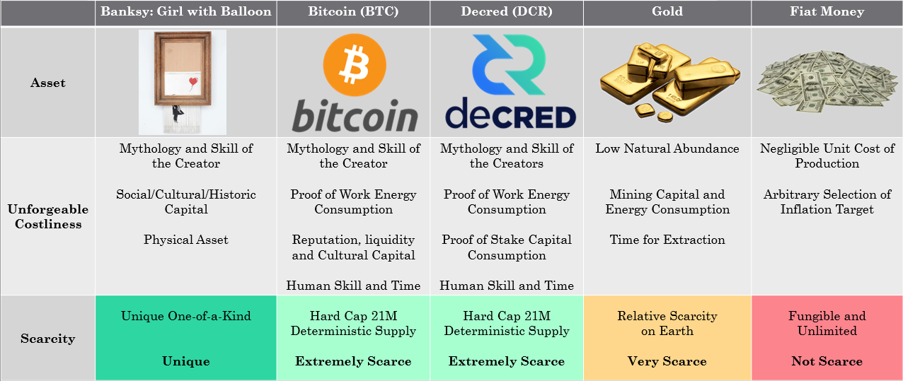
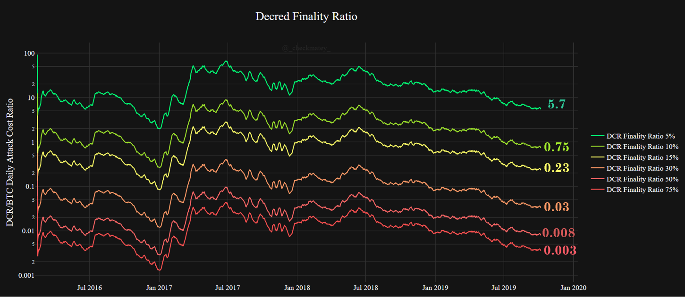

# Decred, Hypersecure and Unforgeably Scarce
*by Checkmate*

*14-Oct-2019*

**Decred** is one of the most promising cryptocurrency projects and a sound competitor next to **Bitcoin** in the free market for scarce digital money. At a minimum, strong market competition forces innovation and hardening of the strongest protocols whilst also providing a rational hedge for risk during the nascent development of digital money.

As **Bitcoin**  continues to assert it's market dominance, it is the correct benchmark against which competitors must be compared. The following article is the second of a three part study into **Decred** from a data driven and first principles perspective. The series aims to critically compare the performance of both **Decred** and **Bitcoin** across the following value metrics:

1. [Monetary policy and Scarcity](https://medium.com/@_Checkmatey_/monetary-premiums-can-altcoins-compete-with-bitcoin-54c97a92c6d4)
2. Cost of Security and Unforgeable Costliness (this paper)
3. Governance, User Adoption and Resilience

# Background

In [Part 1 of this series](https://medium.com/@_Checkmatey_/monetary-premiums-can-altcoins-compete-with-bitcoin-54c97a92c6d4), I established that a convincing relationship exists between **Decred's** scarcity, measured by stock-to-flow ratio, and its market valuation. The linear regression analysis suggests that there is an underlying demand for DCR which is of remarkably similar conviction to that for BTC during it's formative years.

In fact the correlations between **Decred** and **Bitcoin** at an equivalent age of 3.67 years are so strong that additional work is required to establish the depth to which **Decred** is following in **Bitcoin's** footsteps.

In this paper, I explore the **Security and Consensus** mechanisms of **Decred** and **Bitcoin** to quantify the unforgeable costliness of coin production. The immutability and resistance of these protocols to monopolistic capture is the core value proposition which enables the separation of money and state. As such, quantifying the performance and security budgets will provide confidence for people who chose to securely store their wealth in BTC or DCR, potentially for thousands of years to come.

## Disclosure

*This paper was written and researched as part of the author's [research proposal](https://proposals.decred.org/proposals/78b50f218106f5de40f9bd7f604b048da168f2afbec32c8662722b70d62e4d36) accepted by the Decred DAO. Thus, the writer was paid in DCR for their billed time undertaking the research. Nevertheless, the study aims to be objective and mathematically rigorous based on publicly available market and blockchain data. All findings can be readily verified by readers in the attached [spreadsheet]() and all assumptions shall be clearly stated.*

# ***UPDATE SPREADSHEET LINK***

# Part 2 - Unforgeable Costliness

An essential characteristic of a digital sound money protocol is **Unforgeable Costliness**, that is the impossability of producing the asset without a provable expendature of capital, energy and/or time. Unforgeable Costliness stipulates that one of these scarce resources must be exchanged for production of another (capital being an abstraction of both energy and time). Without it, production may be gamed by those with greater access to the source, subsequently destroying the confidence and trust in future expectations of inflation.

Nick Szabo beautifully articulated the idea by describing the unavoidable and expensive costs of production which must exist for an asset to attain a monetary premium.

> "What do antiques, time, and gold have in common? They are costly, due either to their original cost or the improbability of their history , and it is difficult to spoof this costliness” Nick Szabo (2008)

>"Precious metals and collectibles have an unforgeable scarcity due to the costliness of their creation. This once provided money the value of which was largely independent of any trusted third party” Nick Szabo (2005)

Notable Examples of unforgeable costliness and the impact on relative scarcity are presented in the following table with the scarcest assets, that reliably store value over time, having a consistent feature set:

1. **Improbability of existence** due to mythology and skill of the creator, a low natural abundance or a hard coded fixed supply.
2. **Requirement for expenditure  of capital, energy and time** during production in the form of physical mining, Proof-of-Work, capital expenditure  and human effort
3. **Soundness and resistance to arbitrary future inflation** and monopolistic capture due to the difficulty of production and/or counterfeiting.

The remainder of this paper will explore the ***Unforgeable Costliness*** of **Bitcoin** and **Decred** as a gauge on relative scarcity considering this metric. By quantifying the costs associated with each mechanism of coin production, we an form a thesis around the security and resilience of the system to uphold the codified scarcity.

The unforgeable costliness will be explored in the following areas:

1. Cost of Creation
2. Cost of Production
3. Cost of Time

# The Cost of Creation

**Gold**, due to it's atomic properties is of extremely low abundance relative to other commodities. It's existence and supply is a product of the laws of physics and thus may only be acquired via physical exploration and extraction or by purchasing it off the market. This manifests as a natural constraint on supply inflation given demands of production and as a result,global civilisations have converged on gold as the monetary base throughout history.

Industrial uses represent a small fraction of global demand and it is a reasonable conclusion that gold's scarcity and monetary premium underlies demand for jewelry, rather than the other way around.

Scarce digital assets like **Bitcoin** and **Decred** differ to gold in that they are man-made and thus have a discrete, designed genesis event and the incentive model to secure these protocols relies on demand for the scarce native units (BTC and DCR). Thus the initial distribution mechanism must be carefully designed to incentivise protection of the protocol during early life whilst not compromising the market perception of scarcity and fairness.

Appreciation for the initial distribution is important for man-made scarce assets as it carries risk of unfair leverage granted to the creators. Establishing user trust in a money protocol requires great finesse and skill in design, and thus the cost of creation must be the subject of user critique.

## Bitcoin

For **Bitcoin**, Satoshi Nakamoto's design decision was to transparently release the Bitcoin whitepaper on 31 Oct 2018 and the v0.1 Bitcoin and mining code on 9 Jan 2009 to the cypherpunks public email list. This group of people were those most likely to engage with and nurture the protocol through its formative and most vulnerable years.

Numerous studies into early hashrate indicate Satoshi was the dominant miner through the first year with estimates on the number of bitcoins mined ranging from 740k to 980k BTC (of which all are believed to have never been spent). Given there is no way to tell if these coins will ever move, public consensus appears to have accepted this uncertainty as a fair and reasonable thanks for Satoshi's skill and time ([1],[2],[3],[4],[5]).

The evidence strongly suggests Satoshi deliberately reduced his share of network hashrate as new miners entered and the Bitcoin network gained strength. Thus **Bitcoin's** genesis is considered by many to be as fair as a decentralised scarce asset network launch could be.

*Figure: Satoshis Hashrate share after Sergio Demian Lerner*

Key ingredients in **Bitcoin's** initial distribution may be reasonably summarised as follows:
1. Complete transparency months in advance of releasing the code.
2. Permissionless access with appropriate mining tools made available on launch.
3. Awareness raised of those people most likely to nurture the protocol through its most vulnerable early years.
4. Appropriately gradual reduction in the role of the founder.
5. A now formed public consensus that the founder owning around 4% of BTC supply is fair remuneration for their work (value of time and skill).

## Decreds Origin Story
The whitepaper for **Decred's** primitive called [Memcoin2](https://www.decred.org/research/mackenzie2013.pdf) was [originally announced in in April 2013](https://bitcointalk.org/index.php?topic=169204.msg1760397#msg1760397) on the BitcoinTalk forums by an anonymous developer named [tacotime](https://bitcointalk.org/index.php?topic=169204.msg1759914#msg1759914). Paired with another anonymous individual [_ingsoc](https://bitcointalk.org/index.php?topic=169204.msg13024730#msg13024730), tacotime secretly developed the bones of what would ultimately become the Decred project whilst simultaneously working on the Monero project. _ingsoc recruited Company 0 in early 2014, being attracted by the quality of the code written for btcsuite, a process which culminated in the formal announcement of [Decred on 15 Dec 2015](https://bitcointalk.org/index.php?topic=1290358.0).

**Decred's** main-net launched on 8 Feb 2016 at which time the cryptocurrency market had by then reached an elevated state of maturity. **Bitcoin** had attained a market valuation over $6 billion and the market had significantly more participants and eyes (of friends and foes) than at the time of **Bitcoin's** launch. On one hand, these market conditions can benefit coin price appreciation and attract miners and investors, whilst on the other; pose challenges for bootstrapping security without compromising a 'fair initial distribution'. This was compounded by the established GPU mining industry which could have reasonably attacked **Decred** in it's early and vulnerable state. 

### The Pre-mine

An important feature of **Decred** is it's Hybrid PoW/PoS security and consensus mechanism. In order to secure the chain at launch, it was necessary that a majority of honest actors, with an appreciation of the project's philosophy, participate in the Proof-of-Stake ticket system.

For **Decred's** launch, the design decision was to launch the protocol with a pre-mine totaling 1.68M DCR, equivalent to 8% of the total 21M supply. Half of the pre-mine (4%, 840k DCR) was airdropped free to community members to enhance coin distribution and bootstrap the security and governance system. The other half was  purchased by the founding team at a rate of $0.49/DCR either in exchange for their own money or their future development time.

Community registration to participate in the airdrop was [transparently publicised](https://bitcointalk.org/index.php?topic=1290358.0) one month prior to the window close and over 8,793 submissions were received and filtered to remove duplicates and false entries. Ultimately, [282.63795424 DCR was awarded to a total of 2,972 participants](https://docs.decred.org/advanced/premine/#airdrop) who showed a desire for supporting the young protocol. Community and founder participants in the airdrop committed to 12 and 24 month periods respectively where airdropped DCR were not to be exchanged and instead used to bootstrap the Proof-of-Stake ticket system.

Airdrop participants were required to provide a Decred address, as well as a link to a social media identity that showed some interest in cryptocurrency. For miners, [v0.0.4 of cgminer](https://github.com/decred/cgminer/releases) was available at the time of **Decred's** launch and [ccminer v1.7.2 released 3 days later](https://github.com/tpruvot/ccminer/releases/tag/1.7.2-tpruvot) to ensure permissionless access to Proof-of-Work mining.

Details of the **Decred** pre-mine is available in full as part of the [project documentation](https://docs.decred.org/advanced/premine/) and the [block 1 transaction](https://dcrdata.decred.org/tx/5e29cdb355b3fc7e76c98a9983cd44324b3efdd7815c866e33f6c72292cb8be6).

Some notes regarding the **Decred** pre-mine as of the time of writing are: 
- 54% of the pre-mined UTXO set has been spent of which 61% of this represents the community share of airdropped DCR. Thus 4.3% of the total 21M supply created at genesis is spent and considered circulating.
- The unspent portion of the community airdrop is generally assumed to be lost coins representing 1.386% of the total 21M DCR supply
- Of the total founder's reward, 63% remains unspent representing 2.3% of the total 21M DCR supply.

### Early Distribution

The **Decred** block reward structure allocates 30% of the block-reward to Proof-of-Stake and thus results in a persistent dilution of governance rights for all participants. The chart below models the most conservative case (most advantageous for founders) where:
1. All spent DCR from the pre-mine was perfectly staked by community and founders (no consideration of ticket price which in reality results in a portion of an individual's DCR not being included in the stake)

2. No DCR mined via Proof-of-Work or the Treasury enters the stake pool (meaning the pre-mined coins are the only ones that have ever participated in staking)

From this chart, it can be seen that the role of the pre-mined coins has been consistently reduced and diluted over time even under these most conservative conditions. The founder's coins have remained the minority position in the staking pool. During the early years, [Company 0 remained self-funded](https://youtu.be/bTD6_ZLOCMo?t=3430) and did not bill any additional work against the **Decred** treasury until the project had reached maturity and all spent treasury funds were paid to community contractors.

It is also immediately obvious that the ticket pool (blue) has strong correlation to the Proof-of-Work issuance curve (red). This indicates that a combination of miners and people buying coins sold by miners have historically been the dominant participants in the **Decred** ticket system. Blockchain analytics undertaken by Dave Collins [(2017)](https://youtu.be/7K2sDhyjQys?t=1675) suggest that early GPU miners predominantly [merged mined Decred with Ethereum](https://forum.decred.org/threads/claymores-dual-ethereum-decred-siacoin-lbry-pascal-blake2s-keccak-amd-nvidia-gpu-miner-11-6.5957/) and almost invariably distributed DCR to exchanges for sale. This insight adds further evidence of heavy distribution of voting rights away from the founders and into the community as well as a strong desire for participation.

In a very similar manner to Satoshi, the **Decred** founders have taken appropriate and reasonable steps to ensure their stake in the system is diluted, both by design and choice, as the protocol gained strength.

**Decred's** initial distribution thus iterated on **Bitcoin's** ideals to account for the new market dynamics in 2016 and the need for bootstrapping a Hybrid PoW/PoS consensus and security mechanism.

Key ingredients of **Decred's** initial distribution may be reasonably summarised as follows:
1. Complete transparency of both the project genesis (as Memcoin2 and Decred) the conditions of pre-mine participation months in advance of releasing the code.
2. An open application process for community members to participate with appropriate screening for false entries given heightened market awareness. Appropriate staking and mining tools made available at the time of launch across almost all operating systems.
3. Awareness and coin distribution for people most likely to nurture the protocol through the most vulnerable early years.
4. Appropriately gradual reduction in the role of the founding team including a deliberate dilution of voting right. This is exacerbated by the clear distribution of coins by PoW miners into the hands of investing community participants.
5. An end of day founder's reward of 4% of the DCR supply which is consistent with that which public opinion deems fair remuneration for Satoshi's work on Bitcoin (value of time and skill).

It is well known that some in the cryptocurrency industry view pre-mines as a dirty word which exist solely to unfairly benefit founding teams (with many unfortunate examples as evidence). The author has no expectation for changing those minds.

What is desireable is to impart on the more open minded reader that **Decred** was launched in very different environment to **Bitcoin**. By careful design, a small pre-mine acted to both bootstrap network security during the most vulnerable years, allow Decred to remain self-sovereign (no external funding) and reward the team for their skill and time at the same rate as Satoshi Nakamoto.

# The Cost of Production

Whilst it is critical to understand the genesis event of sound money protocols to ensure fairness of launch, the costs associated with it are subjective. It is difficult to assign a consistent value beyond the portion of total coin supply aquired during the 'immaculate conception' of **Bitcoin** (4% Satoshi mine) and the itricate design decisions of **Decred** (8% Decred pre-mine split 50/50). Both genesis events draw from respective cyper-punk roots, anonymous founders and the origin stories and distribution mechanisms will appeal differently to each individual.

However when it comes to quantifying the unforgeable costliness of coin production, it is possible to attribute real world costs in the form of energy, capital and human time invested. Cryptocurrency protocols are global phenomena secured by a complex and diverse range of isolated human interactions with Proof-of-Work mining and Proof-of-Stake lock-up. 

The remainder of this paper aims to quantify this unforgeable costliness by assessing the converse; the cost required to forge coins in an minority chain attack. 

An appropriate assumption in this instance is to expect rational honest actors to act in their own best interest which over time, tends toward an expendature of exactly as much energy, capital and time in production as the value of the asset produced allows. In other words, the marginal cost of production (MC) tends to equallity with the marginal reward (MR), a concept covered by Sztorc ([2014](http://www.truthcoin.info/blog/pow-and-mining/) and [2015](http://www.truthcoin.info/blog/pow-cheapest/)) in relation to PoW and PoS systems.

> Marginal Cost = Marginal Reward.

> If a protocol block reward issues $100 dollars worth of coins, producers will compete and expend up to $100 dollars to create it. If one producer achieves an efficient production cost of $99.00, another producer will eventually achieve a production cost $99.01, until another achieves $99.02.

## Proof-of-Work

**Bitcoin** and **Decred** share a common feature in Proof-of-Work (PoW) as the dominant mechanism for issuing new coins and an integral component of the security system. PoW ensures that the cost of coin production is rooted to the laws of physics with an associated energy consumption and computational capacity requirements. 

Miners are exposed to the following costs denominated in traditional fiat currencies:
1. CAPEX - Cost of mining hardware, establishment costs, capital costs etc
2. OPEX - Electricity consumption, human resources, maintenance etc

These unavoidable mining costs necessitate distribution of coins into the market which enhances wealth distribution and participation opportunity.

**Bitcoin** mining has evolved through several stages with dominant mining hardware progressing through CPUs, GPUs, FPGAs and finally to ASICs chips in 2012-13. **Decred** launched into a 2016 market where GPU miners were readily available and thus had an initial difficulty setting equivalent to the estimated hashpower of 256 contemporary GPU chips. **Decred** mining has progressed to become an ASIC dominated industry in early 2018 [8], [9]. 

The figure below shows the similarities in Bitcoin and Decred PoW growth with hashpower securing the network increasing by around five orders of magnitude over the first four years of operation (including the first bear market).

The progression of a PoW cryptocurrency to an ASIC dominated mining industry is important phase in the security lifecycle. These specific purpose chips are designed soley for mining the hash algorithm and thus lock in miner capital investment to securing the blockchain. ASICs enable massive economies of scale and long term planning of energy contracts and facilities which tends towards fewer and more centralised profitable entities who achieve a competitive MC = MR balance.

Applying the MC = MR framework, we can estimate the dollar denominated cost of coin production. By summing the quantity of coins issued in the block reward and network transaction fees priced at the time of creation, we can quantify the available security subsidy. This metric acts as a ceiling cost where entities with marginal costs higher that this level are, in theory, operating at a loss.

The analysis can been undertaken for two conditions:
1. Cummulative sum of block rewards and fees, representing the total unforgeable costliness of the protocol. This metric may be considered a measure of scarcity accounting for the total value invested to produce the circulating supply.

2. Daily cost to attack the protocol considering only the available security budget within each 24hr period. This daily block subsidy (incl. fees) represents the required cost for a malicious actor to attack the network, generate coins on an alternative chain and undermine protocol integrity.

## Quantifying the Security Budget

For **Bitcoin**, the calculation for both conditions is relatively straight forward with the cummulative cost simply the running sum of the daily cost to attack:

For **Decred**, the hybrid PoW/PoS security mechanism has a number of unique characteristics which increase the relative cost to create an alternative chain and forge DCR coins:

- Each block requires initial PoW mining of a block by expendature of energy and computation

- Mined blocks are then validation by 5 no. PoS Tickets, selected psudorandomly from a pool of a target size of 40,960 tickets.

- A mined block requires 3/5 tickets to approve the block which if not attained, necessitates re-mining the previous block for a second submission to the validators. Thus a minority share of the PoS ticket pool requires a larger share of the hash-rate to re-mine invalidated blocks faster than the honest chain.

- Spamming of the PoS network is constrained by a hard limit of 20 tickets available for sale in each 5min Decred block. Each ticket also has a 24hr period of maturation before entering the pool as well as a 24hr period immediately after voting to prevent spam.

- The ticket price in DCR adjusts every 144 blocks (approx 12hrs) to adjust for relative demand for partcipants entering the target pool size of 40,960 tickets (stake difficulty).

- Where an attacker's block receives less than 5/5 ticket approvals, their PoW block reward is reduced proportionaly and those tickets voting against the majority are stripped of the PoS reward. This component has not been included in this analysis for simplicty however will act to make an attack even more costly as fewer mined/staked DCR are available to offset or sustain the attack.

Production of a competing **Decred** block requires a trade-off between ownership of the PoS ticket pool and a corresponding share of the PoW hash-rate market. 

The share of PoW/PoS required and cost to attack has been documented by Zubair Zia ([2018](https://medium.com/decred/decreds-hybrid-protocol-a-superior-deterrent-to-majority-attacks-9421bf486292)), Fiach_Dubh ([2019](https://medium.com/coinmonks/comparing-double-spend-resistance-decred-vs-bitcoin-part-1-330c8081b2a9)), Haon and Collins ([2018](https://medium.com/decred/detailed-analysis-of-decred-fork-resistance-93022e0bcde7)) and an invaluable paper by Stafford ([2019](https://github.com/buck54321/dcr-research/blob/master/paper/Attack-cost%20estimation.pdf)) which forms the basis of much of this analysis. The core relationship between probability of an attacker validating a block and the hashpower required to match the honest chain is presented in the formulation and chart below.

This security curve shows the relative share of hashpower required to 'forge' a **Decred** block for a given share of the ticket pool (orange). It also presents amount of time (in days) of which an attacker would need to continuously buy all 20 tickets in every block to achieve this share of the pool (blue). This analysis does not account for honest ticket purchases diluting the attacker, nor the inevitable increase in the ticket price in DCR in response to the attacker's ticket demand.

A hashpower multiple of 1.0 implies the attacker needs hashpower equal to the honest miners (a traditional 51% attack) in addition to the cost of the tickets. The chart is curtailed at a 75% share of the ticket pool as this is the threshold at which protocol governance decisions can be passed regarding a chain fork, and arguably better termed the point of 'consensus' than an 'attack'.

It can be seen that for a share of tickets less than 25%, the required hashpower to forge a **Decred** block increases exponentially and requires greater than 10x the honest miner hashpower. At 50% of tickets, **Decred** security functions similar to a pure PoW chain requiring a 51% attack to double spend, albeit with the additional cost to aquire 50% of the tickets.

> Decred's Hybrid security mechanism maintains the core value proposition of the pure PoW system employed by Bitcoin and overlays PoS validation akin to two-factor authentication. This enhances the actual security by orders of magnitude in the most probable scenarios of ticket ownership share by an attacker.

## Unforgeable Costliness of BTC and DCR

Accounting for the relationship between **Decred's** hybrid PoW and PoS components, the Unforgeable Costliness of DCR may be calculated for any theoretical share of attacker tickets. 

To provide context and reasonable grounds for selecting a feasible attack scenario, the author has determined known points of DCR centralisation which could launch or supply a coordinated attack on the **Decred** network. This includes known exchange wallets, the founder pre-mine, operating stake-pools (47.52% of tickets total) and the protocol treasury (which equally could be deployed in defense by stakeholders in the most extreme scenario). 

The analysis assumes that the entity purchases tickets at the current typical price of 140DCR and is entering a target pool of 40,960 tickets. No penalty is considered for the unavoidable ticket price increase resulting from an attackers ticket demand.

On this basis, the following representative cases have been used to calculate the cummulative Unforgeable Costliness of both **Bitcoin** and **Decred** throughout their history, plotted against coin age (circ. supply / 21M). The market cap of Bitcoin and Decred at the time of writing are $141.2B and $188.0M for calculating the Unforgeable Costliness to Market Cap ratio.

It can quickly be ascertained that at a low but reasonable proportion of tickets held (<10%), the cummulative cost to forge DCR on a minority chain would be $16.6+ Billion, 11% higher than for Bitcoin across it's entire lifespan. That minority Decred chain would also require consistent input of 115x of the current operational PoW mining hash-power which is considered by the author to be both unlikely and impractical.

In the instance of a malicious cartel including all stake-pools which currently host 47.52% of tickets, the unforgeable costliness of DCR (50% ticket case) reduces to around $0.179 Billion, approximately equal to the Market Cap of the Decred protocol. This attack essentially necessitates a cost equal to the protocols entire valuation whilst also needing an equal amount of hashpower to the honest miners. It is important to note that Bitcoin is currently worth $141 Billion, approximately 10x it's unforgeable costliness.

As an extreme case, it is appropriate that the cost to attack would be commeasurate with the value of the target (the Decred protocol).

On the basis of this analysis, it can be argued that the Unforgeable Costliness of production for DCR at the time of writing, with 10% of tickets owned, is greater than the unit Unforgeable Costliness of BTC production. A remarkable feat for a project 680x smaller in market valuation that Bitcoin.

## Finality of Bitcoin and Decred

The second analysis considers the real-time cost to attack each protocol on a daily basis to establish the relative settlement finality of transactions. Whilst the cummulative protocol cost is a valuable metric for scarcity and long term security, the consistency and level of network security on a daily basis is of the utmost importance for a functional sound money protocol.

Two cases have been considered for Bitcoin 
1) Bitcoin at 50% coins mined (the equivalent coin age as Decred)
2) Bitcoin at 85.6% coins mined (present day)

**Decred** again shows remarkable performance with an upper bound daily security budget of 28% of the total network value (5% tickets) and a lower bound of 0.02%, corresponding to an attacker share of 5% and 75% of tickets, respectively. For comparison, Bitcoin at an equivalent age (50% mined) maintained a daily security budget of 2.4% (10x less) and is currently supported by a daily budget of 0.01% of network value.

> In the upper bound condition of 5% of tickets owned, Decred boasts a superior daily security cost and finality relative to Bitcoin, making the protocol the most secure blockchain known to the author. 

For finality analysis, it is the author's opinion that an attacking ticket share of 30% is appropriate considering it would be feasible, albeit difficult, to coordinate an attack with dominant cenytralised stakepools and exchanges involved. It is important to note the following considerations which still make this attack vector unlikely:
- The attack would require 5x the live Decred hashpower with associated logistics and on-chain signiatures.
- It would permanently damage the reputation of all centralised entities involved (a similar game theory logic often leveled against Bitcoin).
- The defensive actions of honest Decred participants are ignored.
- Notable conservatisms are present in this analysis including ignoring the reduced block reward on a minority chain and a static ticket price. 

The Decred Finality Ratio is defined as the real time ratio between Daily cost to attack Decred over Bitcoin. A finality ratio of 2.0 indicates 

# References

[1] The Well Deserved Fortune of Satoshi Nakamoto, Bitcoin creator, Visionary and Genius, https://bitslog.com/2013/04/17/, the-well-deserved-fortune-of-satoshi-nakamoto/, Sergio Demian Lerner, 2013

[2] https://bitslog.com/2013/04/24/satoshi-s-fortune-a-more-accurate-figure/, Sergio Demian Lerner, 2013

[3] Satoshis Hashrate, https://organofcorti.blogspot.com/2014/08/167-satoshis-hashrate.html, Sergio Demian Lerner, 2014

[4] Does Satoshi have a million bitcoin?, https://blog.bitmex.com/satoshis-1-million-bitcoin/, BitMEX Reseacrch, 2018

[5] Bitcoin’s Distribution was Fair, https://blog.picks.co/bitcoins-distribution-was-fair-e2ef7bbbc892, Dan Held, 2018

[6] Decred Assembly Ep 2 - 2017 Roadmap, https://www.youtube.com/watch?v=bTD6_ZLOCMo&list=PLaMrpvQ0yJ_z8ZtvgBqinmL74_0W7prv2&index=25, Decred, 2017

[7] Decred: Where did it all begin?, https://thedecreddigest.com/2017/06/10/decred-where-did-it-all-begin/, The Decred Digest, 2017

[8] Decred Assembly Ep 15 - Decred and ASICs, https://youtu.be/7K2sDhyjQys, Decred, 2017

[9] Decred Assembly Ep 16 - Decred and ASICs Part II, https://youtu.be/8TPFIVYy_i4, Decred, 2017

[] Decred: Rethink Digital Currency, https://blog.companyzero.com/2015/12/decred-rethink-digital-currency/, Company Zero, 2015

[] Decred, Where did it all begin?, https://thedecreddigest.com/2017/06/10/decred-where-did-it-all-begin/, The Decred Digest, 2017

[] Long Live Proof-of-Work, Long Live Mining, http://www.truthcoin.info/blog/pow-and-mining/, Sztorc, 2014

[] Nothing is Cheaper than Proof of Work, http://www.truthcoin.info/blog/pow-cheapest/, Sztorc, 2015