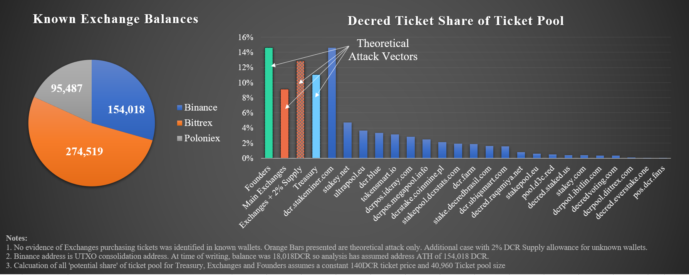
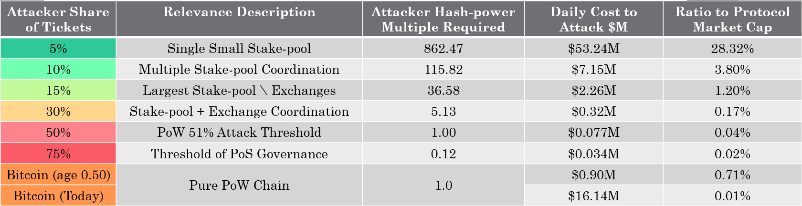
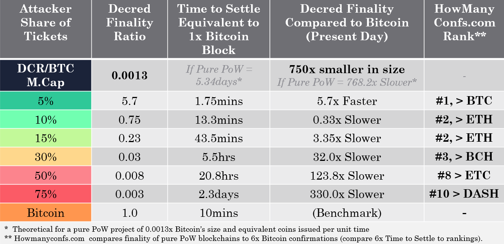

# Decred, Hypersecure, Unforgeably Scarce
*by Checkmate*

*29-Nov-2019*

**Decred** is one of the most promising cryptocurrency projects and a sound competitor next to **Bitcoin** in the free market for scarce digital money. At a minimum, strong market competition forces innovation and hardening of the strongest protocols whilst also providing a rational hedge for risk during the nascent development of digital money.

As **Bitcoin**  continues to assert it's market dominance, it is the correct benchmark against which competitors must be compared to develop a sound thesis supported by performance data. The following article is the second of a three-part study into **Decred** from a data-driven and first principles perspective. The series aims to critically compare the performance of both **Decred** and **Bitcoin** across the following value metrics:

1. [Monetary policy and Scarcity](https://medium.com/@_Checkmatey_/monetary-premiums-can-altcoins-compete-with-bitcoin-54c97a92c6d4)
2. Cost of Security and Unforgeable Costliness (this paper)
3. Governance, User Adoption, and Resilience

# Background

In [Part 1 of this series](https://medium.com/@_Checkmatey_/monetary-premiums-can-altcoins-compete-with-bitcoin-54c97a92c6d4), I established that a convincing relationship exists between **Decred's** scarcity, measured by stock-to-flow ratio, and its market valuation. The linear regression analysis suggests that there is an underlying demand for DCR, which is of remarkably high conviction and similar to that for BTC during its formative years.

The correlations between **Decred** and **Bitcoin** at an equivalent age of 3.67 years (50% coins mined) are so strong that additional work is justified to establish the depth to which **Decred** is following in **Bitcoin's** footsteps and competing in performance.

In this paper, I explore the **Security and Consensus** mechanisms of **Decred** and **Bitcoin** to quantify the unforgeable costliness of coin production, cost to attack each network, and the finality of transactions secured by each ledger. 

Immutability and censorship resistance are the core value proposition of sound money protocols and that which truly enable the separation of money and state. As such, quantifying the security budgets, performance, and finality will provide confidence for users, investors, and speculators who choose to store their wealth in BTC and DCR, potentially for hundreds of years into the future.

## TL; DR
- **Decred's** hybrid PoW/PoS security protocol requires an attacker to the trade-off between a share of the ticket pool and an associated share of the hash-power market.

- Assuming a framework of marginal cost = marginal reward, Decred not only meaningfully competes with Bitcoin, but it also outpaces it in sevral metrics regarding blockchain security and finality.

- Based on these studies, Decred can reasonably be considered one of the top three most secure and censorship-resistant public ledgers in the market.

## Disclosure

*This paper was written and researched as part of the author's [research proposal](https://proposals.decred.org/proposals/78b50f218106f5de40f9bd7f604b048da168f2afbec32c8662722b70d62e4d36) accepted by the Decred DAO. Thus, the writer was paid in DCR for their billed time undertaking the research. Nevertheless, the study aims to be objective and mathematically rigorous based on publicly available market and blockchain data. All findings can be readily verified by readers in the attached [spreadsheet](analysis/dcr_unforgeable_analysis.xlsx) and all assumptions shall be clearly stated.*

# Unforgeable Costliness

An essential characteristic of a digital sound money protocol is **Unforgeable Costliness**, which is the impossibility of producing the asset without a provable expenditure of capital, energy, and/or time. Unforgeable Costliness stipulates that one of these scarce resources must be exchanged for production of another (capital being an abstraction of both energy and time). Without it, production may be gamed by those with greater access to the source, subsequently destroying the confidence and trust in future expectations of inflation.

Nick Szabo beautifully articulated the idea by describing the unavoidable and expensive costs of production, which must exist for an asset to attain a monetary premium.

> "What do antiques, time, and gold have in common? They are costly, due either to their original cost or the improbability of their history , and it is difficult to spoof this costliness” Nick Szabo (2008)

>"Precious metals and collectibles have an unforgeable scarcity due to the costliness of their creation. This once provided money the value of which was largely independent of any trusted third party” Nick Szabo (2005)

Notable Examples of unforgeable Costliness and the impact on relative scarcity are presented in the following table. The scarcest assets are those who reliably store value over time and can be seen to have a consistent feature set:

1. **Improbability of existence** due to mythology and skill of the creator, a low natural abundance, or a hardcoded fixed supply.
2. **Requirement for the expenditure of capital, energy, and time** during production in the form of physical mining, Proof-of-Work, capital expenditure, time, and human effort.
3. **Soundness and resistance to arbitrary future inflation** and monopolistic capture due to the difficulty of production and/or counterfeiting.

The remainder of this paper will explore the ***Unforgeable Costliness*** of **Bitcoin** and **Decred** as a gauge on relative scarcity and protocol security. By quantifying the unavoidable costs associated with coin production, we may formulate a thesis regarding the security, finality and resilience of the protocol to uphold the codified scarcity.

# Value in Authenticity

**Gold**, due to its atomic properties, is of extremely low abundance relative to other commodities. It's existence and supply is a product of the laws of physics and thus may only be acquired via exploration and extraction or by purchasing it off the market. This manifests as a natural constraint on inflation, given the demands of production.

As a result, global civilisations have converged on gold as the monetary base throughout history, and industrial uses represent only a small fraction of global gold demand. It seems a reasonable conclusion that gold's scarcity and monetary premium underlies its demand for jewelry as a status symbol, rather than the other way around.

Scarce digital assets like **Bitcoin** and **Decred** differ to gold in that they are man-made and thus have a discrete, designed genesis event. The incentive model to secure these protocols relies on demand for the scarce native units (BTC and DCR). Thus, the initial distribution mechanism must be carefully designed to incentivise security during early life whilst simultaneously achieving a market perception of scarcity and fairness.

Appreciation for the initial distribution is important for scarce man-made assets as it carries the risk of unfair leverage granted to the creators. Establishing user trust in a money protocol requires great finesse in the design, and thus the cost of creation must be the subject of user critique.

## Bitcoin

For **Bitcoin**, Satoshi Nakamoto's design decision was to transparently release the Bitcoin whitepaper on 31 Oct 2018 and the v0.1 Bitcoin and mining code on 9 Jan 2009 to the cypherpunks public email list. This group of people were those most likely to engage with and nurture the protocol through its formative and most vulnerable years.

Numerous studies into early hashrate indicate Satoshi was the dominant miner out of necessity through the first year with estimates on the number of bitcoins mined ranging from 740k to 980k BTC (of which all are believed to have never been spent). Given there is no way to tell if these coins will ever move, public consensus appears to have accepted this uncertainty as a fair and reasonable thanks for Satoshi's skill and time (Lerner, [2013a](https://bitslog.com/2013/04/17/), [2013b](https://bitslog.com/2013/04/24/satoshi-s-fortune-a-more-accurate-figure/), [2014](https://organofcorti.blogspot.com/2014/08/167-satoshis-hashrate.html); [BitMEX Research, 2018](https://blog.bitmex.com/satoshis-1-million-bitcoin/); [Held, 2018](https://blog.picks.co/bitcoins-distribution-was-fair-e2ef7bbbc892)).

The evidence suggests that Satoshi deliberately reduced his share of network hash-rate as new miners entered, and the network gained strength. It is estimated that Satoshi's influence on the mining network persisted for around 16 months until his distinctive mining signature dissipated. Thus **Bitcoin's** genesis is considered by many to be as fair as a decentralised scarce asset network launch could be.

[*Figure: Satoshis Hashrate share after Sergio Demian Lerner*](https://organofcorti.blogspot.com/2014/08/167-satoshis-hashrate.html)

Key ingredients in **Bitcoin's** initial distribution may be reasonably summarised as follows:
1. Complete transparency months in advance of releasing the code.

2. Permissionless access to the code with appropriate mining tools made available on launch.

3. Awareness raised by those people most likely to nurture the protocol through its most vulnerable early years.

4. An appropriately gradual reduction in the role of the founder as the network gained strength.

5. A now formed public consensus that the founder owning around 4% of BTC supply is fair remuneration for their work (value of time and skill).

## Decreds Origin Story
The whitepaper for **Decred's** primitive called [Memcoin2](https://www.decred.org/research/mackenzie2013.pdf) was [initially announced in April 2013](https://bitcointalk.org/index.php?topic=169204.msg1760397#msg1760397) on the BitcoinTalk forums by an anonymous developer named [tacotime](https://bitcointalk.org/index.php?topic=169204.msg1759914#msg1759914). Paired with another anonymous individual [_ingsoc](https://bitcointalk.org/index.php?topic=169204.msg13024730#msg13024730), tacotime secretly developed the bones of what would ultimately become the Decred project whilst simultaneously working on Monero. _ingsoc recruited Company 0 in early 2014, being attracted by the quality of the code written for btcsuite. This culminated in the formal announcement of [Decred on 15 Dec 2015](https://bitcointalk.org/index.php?topic=1290358.0).

**Decred's** main-net launched on 8 Feb 2016, at which time the cryptocurrency market reached an elevated state of maturity. **Bitcoin** had attained a market valuation of over $6 billion, and the market had significantly more participants and eyes (of friends and foes) compared to the time of **Bitcoin's** launch. 

On the one hand, these market conditions can benefit coin price appreciation and attract miners and investors whilst on the other, pose challenges for bootstrapping security without compromising a 'fair initial distribution'. This was compounded by the established GPU mining industry, which could have reasonably attacked **Decred** in it's early and vulnerable state.

## The Decred Pre-mine

A differentiating feature of **Decred** is it's unique hybridised PoW/PoS security and consensus mechanism. To secure the chain at launch, it was necessary that a majority of honest actors, with an appreciation of the project's philosophy, participate in the Proof-of-Stake ticket system.

For **Decred**, the design decision was to launch the protocol with a pre-mine totaling 1.68M DCR, equivalent to 8% of the total 21M supply. Half (4%, 840k DCR) was airdropped free to community members to enhance coin distribution and bootstrap security and governance. The founding team purchased the other half at a rate of $0.49/DCR either in exchange for their own money or their future development time.

Community registration to participate in the airdrop was [transparently publicised](https://bitcointalk.org/index.php?topic=1290358.0) one month before the window close, and over 8,793 submissions were received and filtered to remove duplicates and false entries. Airdrop participants were required to provide a Decred wallet address, as well as a link to a social media identity that showed some interest in cryptocurrency. Ultimately, [282.63795424 DCR was awarded to a total of 2,972 participants](https://docs.decred.org/advanced/premine/#airdrop).

For miners, [v0.0.4 of cgminer](https://github.com/decred/cgminer/releases) was available at the time of **Decred's** launch and [ccminer v1.7.2 released 3 days later](https://github.com/tpruvot/ccminer/releases/tag/1.7.2-tpruvot) to ensure permissionless access to Proof-of-Work mining. Decred code was available on almost all operating systems imaginable.

Details of the **Decred** pre-mine are available in full as part of the [project documentation](https://docs.decred.org/advanced/premine/) and the [block 1 transaction](https://dcrdata.decred.org/tx/5e29cdb355b3fc7e76c98a9983cd44324b3efdd7815c866e33f6c72292cb8be6).

Some notes regarding the **Decred** pre-mine as of the time of writing are: 
- 54% of the pre-mined UTXO set has been spent, of which 61% represents the community share. Thus 4.3% of the total 21M supply created at genesis is spent and considered circulating.
- The unspent portion of the community airdrop is generally assumed to be lost coins representing 1.386% of the total 21M DCR supply.
- Of the total founder's reward, 63% remains unspent, representing 2.3% of the total 21M DCR supply.

## Early Distribution

The **Decred** block structure allocates 30% of the block-reward to Proof-of-Stake, which results in a persistent dilution of governance rights for all participants. The chart below models the most conservative case (most advantageous for founders) where:
1. All spent DCR from the pre-mine was perfectly staked by community and founders (no consideration of ticket price which in reality results in a portion of an individual's DCR not being included in the stake)

2. No DCR mined via Proof-of-Work, or the Treasury enters the stake pool (meaning the pre-mined coins are the only ones that have ever participated in staking)

From this chart, it can be seen that the role of the pre-mined coins (dashed lines) has been consistently diluted over time, even under these most conservative conditions. The founder's coins have always remained the minority position in the staking pool. 

During the early years, [Company 0 remained self-funded](https://youtu.be/bTD6_ZLOCMo?t=3430) and did not bill any additional work against the **Decred** treasury until the project had reached maturity and works were approved by DCR holders. All spent treasury funds during these formative years were paid to community contractors, building a strong foundation of supporters.

It is also immediately evident that the ticket pool (blue) has a strong correlation to the Proof-of-Work issuance curve (red). This indicates that a combination of miners and people buying coins sold by miners have historically been the dominant participants in the **Decred** ticket system. 

Blockchain analytics undertaken by Dave Collins [(2017)](https://youtu.be/7K2sDhyjQys?t=1675) suggest that early GPU miners predominantly [merged mined Decred with Ethereum](https://forum.decred.org/threads/claymores-dual-ethereum-decred-siacoin-lbry-pascal-blake2s-keccak-amd-nvidia-gpu-miner-11-6.5957/) and almost immediately distributed DCR to exchanges for sale. This insight adds further evidence of the heavy distribution of voting rights away from the founders and miners and into the community as well as signals a strong desire for participation.

In a very similar manner to Satoshi, the **Decred** developers (Company 0) have taken appropriate and reasonable steps to ensure their stake in the system is diluted, both by design and choice, as the protocol gained strength. The anonymous founders tacotime and _ingsoc have since disappeared.

**Decred's** initial distribution thus iterated on **Bitcoin's** ideals to account for the new market dynamics in 2016 and the need for bootstrapping a Hybrid PoW/PoS consensus and security mechanism.

Key ingredients of **Decred's** initial distribution may be reasonably summarised as follows:
1. Complete transparency of the project genesis (as Memcoin2 and Decred) and the conditions of pre-mine participation months in advance of releasing the code.

2. An open application process for community members to participate with appropriate screening for false entries given heightened market awareness. Appropriate staking and mining tools made available at the time of launch across almost all operating systems.

3. Awareness and coin distribution for people most likely to nurture the protocol through the most vulnerable early years.

4. The appropriately gradual reduction in the role of the founding team, including a deliberate dilution of voting right. This is exacerbated by the apparent distribution of coins by PoW miners into the hands of the investing community, who evidence suggests are the dominant participants.

5. An end of day founder's reward of 4% of the DCR supply which is consistent with the public opinion of fair remuneration for Satoshi's work on Bitcoin (value of time and skill).

## On Decreds Launch

It is well known that some folks in the cryptocurrency industry view pre-mines as a dirty word that exists solely to unfairly benefit founding teams (with many unfortunate examples as evidence). The author has no expectation of changing those minds.

It is desirable to impart on the more open-minded reader that **Decred** was launched in a very different environment to **Bitcoin**. By careful and intricate design, a small pre-mine acted to bootstrap network security during the most vulnerable years, allow Decred to remain self-sovereign with no external funding or influence, and reward the team for their skill and time at the same rate as Satoshi Nakamoto.

# The Cost of Acquisition

Whilst it's critical to understand the genesis event of sound money protocols and ensure fairness of launch, the costs associated with it are subjective. It is difficult to assign a consistent value beyond a portion of the total coin supply acquired during the 'immaculate conception' of **Bitcoin** (4% Satoshi mine) or the intricate design decisions of **Decred** (8% pre-mine split 50/50). Both genesis events draw from respective cypher-punk roots, anonymous founders, and the distribution mechanisms will appeal differently at an individual level.

However, it is possible to attribute real-world costs in the form of energy, capital, and human time invested, to quantify the unforgeable costliness of coin production. Given cryptocurrency protocols are a global phenomenon secured by a complex and diverse range of isolated human interactions, a framework is therefore required to simplify the problem. 

An appropriate assumption in this instance is to expect rational actors to behave in their own best interest. Over time this will tend toward an expenditure of exactly as much energy, capital, and time in coin production as the value of the coins produced allow for . 

In other words, the marginal cost of production (MC) tends to equality with the marginal reward (MR). This concept is well covered by Sztorc ([2014](http://www.truthcoin.info/blog/pow-and-mining/) and [2015](http://www.truthcoin.info/blog/pow-cheapest/)) in relation to PoW and PoS systems.

> Marginal Cost = Marginal Reward.

> If a protocol block reward issues $100 worth of coins, producers will compete and expend up to $100 to create it. If one producer achieves an efficient production cost of $99.00, another producer will eventually be willing to expend a production cost of $99.01. Another will then out-bid with a cost of $99.02 until the cost ultimately approaches the reward.

The following analysis quantifies each protocol's unforgeable costliness and settlement finality using this framework and assessing the converse; the unavoidable costs that are required to forge coins in a minority chain attack.

## Proof-of-Work

**Bitcoin** and **Decred** share a common feature in Proof-of-Work (PoW) as the dominant mechanism for issuing new coins. PoW is an integral component of the security and incentive system. It ensures the cost of coin production is rooted in the laws of physics with an energy and computation requirement.

Miners are therefore exposed to the following costs denominated in local fiat currencies:
1. CAPEX - Cost of mining hardware, establishment costs, warehousing, and logistics.
2. OPEX - Electricity consumption, human resources, maintenance, and capital costs.

**Bitcoin** mining has evolved through several stages, with dominant mining hardware progressing through CPU, GPU, FPGA, and finally, to ASIC chips in 2012-13. **Decred** launched into a 2016 market where GPU miners were readily available and thus had an initial difficulty setting equivalent to the hashpower of 256 contemporary GPUs. **Decred** mining has since progressed to become an ASIC dominated industry as of early 2018 [[8](https://youtu.be/7K2sDhyjQys)], [[9](https://youtu.be/8TPFIVYy_i4)].

The figure below shows the similarities in the growth of the Proof-of-Work industries for **Bitcoin** and **Decred**. Both protocols have seen hashpower securing the network increase by five orders of magnitude over the first four years of operation, with both weathering a bear market during this time.

The progression of a PoW cryptocurrency to an ASIC dominated mining industry is a crucial phase in the security lifecycle. These specific purpose chips are designed solely for mining a hashing algorithm and thus lock in miner capital investment into securing the blockchain. ASICs enable massive economies of scale and long term planning of energy contracts and facilities. 

The result of this is mining tends towards fewer and more centralised but profitable entities who achieve a competitive MC = MR balance.

> Applying the MC = MR framework, we can estimate the dollar-denominated cost of coin production. By summing the number of coins issued in the block reward and network transaction fees priced at the time of creation, we quantify the total available security subsidy (MR). This metric acts as a ceiling cost where, on aggregate, miners carrying marginal costs (MC) higher than this level are, in theory, operating at a loss and will eventually go out of business.

# Quantifying the Security Budget

The analysis has been undertaken for two conditions:

**Case 1** - Cumulative sum of block rewards and fees over time, representing the total **unforgeable costliness** of the protocol. This metric may be considered a measure of scarcity, accounting for the total value expended to produce the circulating supply.

**Case 2** - Daily cost to attack the protocol considering only the available security budget within a 24hr period. This metric represents the minimum cost for a malicious actor to attack the network, generate coins on an alternative chain, and undermine protocol integrity. This is key to understanding the **settlement finality** for transactions and value secured by the ledger.

For **Bitcoin**, the calculation for both conditions is relatively straight forward with the unforgeable costliness of BTC simply equating to the running sum of daily security subsidy:

Two Bitcoin cases have been summarised for an apples-to-apples comparison:
1) Bitcoin at 50% coins mined (the equivalent coin age as Decred)
2) Bitcoin at 85.6% coins mined (present-day)

For **Decred**, the hybrid PoW/PoS security mechanism has several unique characteristics that affect the relative cost to create a competing minority chain and forge DCR coins:

- Each block requires initial PoW mining of a block by the expenditure of energy and computation.

- Mined blocks are then validated by PoS Tickets, selected pseudorandomly from a pool of a target size of 40,960 tickets.

- A mined block requires 3/5 tickets to approve the block, which, if not attained, necessitates re-mining the previous block for a new submission to validators. Thus a minority share of the PoS ticket pool requires a larger share of the hash-rate to re-mine invalidated blocks faster than the honest chain.

- Spamming of the PoS network is constrained by a hard limit of 20 tickets available for sale in each Decred block (targets 5 min block times). Each ticket also has a 256 block of maturation before entering the pool, as well as an equivalent immaturity period immediately after voting. This ensures tickets are exposed to price volatility, and an attacker must, therefore, assume their locked coins reduce to negligible value if the attack is successful.

- The ticket price in DCR adjusts every 144 blocks (approx 12hrs) to account for relative demand for a spot in the target pool size of 40,960 tickets (the stake difficulty).

- Where an attacker's block receives less than 5/5 ticket approvals, their PoW block reward is reduced 
ly for each ticket voting in the minority, and minority tickets do not receive the PoS reward. This component of the system has not been included in this analysis for simplicity; however, it will act to make an attack even more costly as fewer mined/staked DCR are available to offset and sustain the attack.

Production of a competing **Decred** block, therefore, requires a trade-off between a share of the PoS ticket pool and a corresponding share of the PoW hash-rate market. 

The share of PoW/PoS required and cost to attack has been documented by Zubair Zia ([2018](https://medium.com/decred/decreds-hybrid-protocol-a-superior-deterrent-to-majority-attacks-9421bf486292)), Fiach_Dubh ([2019](https://medium.com/coinmonks/comparing-double-spend-resistance-decred-vs-bitcoin-part-1-330c8081b2a9)), Haon and Collins ([2018](https://medium.com/decred/detailed-analysis-of-decred-fork-resistance-93022e0bcde7)) and an invaluable paper by Stafford ([2019](https://github.com/buck54321/dcr-research/blob/master/paper/Attack-cost%20estimation.pdf)) which forms part-basis for this analysis. 

The core relationship between the probability of an attacker successfully validating a block and the hashpower required to keep up with the honest chain is presented in the formulation and chart below.

The Decred security curve shows the required multiple of honest hashpower an attacker needs to 'forge' a **Decred** block for a given share of the ticket pool (orange). It also presents the amount of time (in days) to which an attacker would need to commit to buying all 20 tickets in every block to achieve that share of the pool (blue). 

This analysis does not account for honest ticket purchases diluting the attacker, nor the inevitable increase in the ticket price in DCR in response to the attacker's ticket demand.

A hashpower multiple of 1.0 implies the attacker needs hashpower equal to the honest miners (a traditional 51% attack) in order to keep up with the honest chain [(Haon and Collins, 2019)](https://medium.com/coinmonks/comparing-double-spend-resistance-decred-vs-bitcoin-part-1-330c8081b2a9). The chart is curtailed at a 75% share of the ticket pool as this represents the threshold at which protocol governance decisions can be passed supporting a chain fork. Arguably, this point is better termed 'consensus' than an 'attack'.

It can be seen that for a share of tickets less than 25%, the required hashpower to forge a **Decred** block increases exponentially and requires in excess of 10x the honest miner hashpower. At 50% of tickets, **Decred** security functions similar to a pure PoW chain, still requiring a 51% attack to double-spend, albeit with the additional cost to acquire DCR amounting to 50% of the ticket pool.

> Decred's Hybrid security mechanism maintains the core value proposition of the pure PoW system employed by Bitcoin and overlays PoS validation akin to two-factor authentication. This enhances the actual security by orders of magnitude in the most probable scenarios whilst simultaneously mitigating the risk of the inevitable centralisation of miners.

# Unforgeable Costliness of BTC and DCR

Accounting for the relationship between **Decred's** hybrid PoW and PoS components, the Unforgeable Costliness of DCR may be calculated for any theoretical share of attacking tickets. 

To provide context and grounds for a rational attack scenario, the author has determined known points of DCR centralisation that could launch or supply a coordinated attack on the **Decred** network. This includes known large exchange wallets, the founder pre-mine, operating stake-pools (holding an aggregate of 47.52% of tickets at the time of writing), and the protocol treasury (which equally could be deployed in defense by stakeholders in the most extreme scenario). 

The analysis assumes that for these 'potential vectors', the entity purchases tickets at the current typical price of 140 DCR and is entering a target pool of 40,960 tickets. No penalty is considered for the inevitable ticket price increase that would result from the attacker's ticket demand, which would increase the required DCR coin supply.

The representative cases have been used to calculate the cumulative Unforgeable Costliness of both **Bitcoin** and **Decred** through their history. Results are plotted against coin age (circ. supply / 21M) to normalise for the stage in protocol lifespan. 

The current market caps for calculating the Unforgeable Costliness to Market Cap ratio (a metric of security to valuation) of each protocol are: 
- Bitcoin at 50% coins mined =  $127.0M.
- Bitcoin at the time of writing = $141.2B.
- Decred at the time of writing = $188.0M.

It is quickly ascertained that at a low but reasonable proportion of tickets held (<10%), the cumulative cost to forge DCR on a minority chain would be $16.6+ Billion, 11% higher than Bitcoin's lifetime cost of $14.87 Billion. That minority Decred chain would also require a consistent input of 115x of the current honest PoW hash-power, which the author considers to be both unlikely and impractical.

In the instance of a malicious cartel including all stake-pools and exchanges, the unforgeable costliness of DCR (50% ticket case) reduces to around $0.179 Billion, approximately equal to the Market Cap of the Decred protocol. This attack necessitates a cost equal in value to that of the target whilst also needing an amount of hashpower equal to the honest miners (a 51% attack).

Bitcoin at an equivalent age of 50% coins mined carried an unforgeable costliness of $37Million (30% of its Market Cap) and is currently valued at $141 Billion, approximately 10x it's unforgeable costliness. This indicates a measure of Bitcoin's monetary premium gained over time. It is notable that Decred currently carries a monetary premium 3.3x greater than Bitcoin did at 50% coins mined when considering the extreme case of a 50% ticket attack vector as an analogue for pure PoW.

On the basis of this analysis, it can be argued that the Unforgeable Costliness for DCR is extremely competitive compared to the production cost of BTC, especially for the most probable attack vectors with less than 15% of the ticket pool.

- For the most probable <15% share of offensive tickets, DCR costliness is greater than 28x the network value and exceeds the lifetime costliness of BTC for a ticket share <10%.

- For an extreme case of a 30% to 50% share of offensive tickets, DCR costliness is 1x to 4x the network value and is at a premium of 20x and 2.2x the historic costliness of BTC at 50% coins mined.

These are remarkable numbers for a protocol 750x smaller in market valuation (0.12% the size) of Bitcoin.

# Finality of Bitcoin and Decred

The second analysis considers the cost to attack each protocol daily to establish a relative settlement finality for transactions. Whilst the cumulative protocol cost is a valuable metric for scarcity and long term security, the consistency and magnitude of network security day-to-day is of the utmost importance for a functional sound money protocol.

Finality represents how resistant a blockchain is to being re-organised during an attack that ing to censor or roll-back a transaction [unclear sentence]. A blockchain with a significant security budget implies each transaction is settled by significant honest costliness which acts as a deterrent that an attacker must overcome (Carter, 2019, Permabull Nino,2018) 

A blockchain with a $100M daily security budget can be considered to settle $100M/day. Sending a $500M transaction remains profitable for an attacker to re-organise until it costs more than the target value to do so. Finality is the most critical functional characteristic of a blockchain, and it is irrespective of block-time. A rational actor will consider a single Bitcoin confirmation equivalent to hundreds to thousands of a less secure blockchain. 

The table and chart below present the 24hr security costliness for the Bitcoin and Decred ledgers, which an attacker must overcome to initiate a re-organisation. Note that this assumes the MC = MR framework and does not account for the actions of miners and stakeholders who would likely operate at a short term loss in defensive action under a genuine attack scenario.

Decred again shows remarkable performance:
- Upper bound Decred 24hr security cost is equivalent to 28% of network value at 5% ticket share which notably exceeds Bitcoins current finality assurance
- Lower bound Decred 24hr security cost equivalent to 0.02% of network value at 75% ticket share and equivalent to Bitcoins historic finality assurance at the same age of 50% coins mined.
- Bitcoin at 50% coins mined maintained a 24hr security cost of 2.4% of network value.
- Bitcoin is currently supported by a 24hr security cost of 0.01% of network value.

> In the upper bound condition of 5% of tickets owned, Decred boasts a superior daily security cost and finality relative to Bitcoin, making the Decred protocol the most secure blockchain known to the author. In the extreme lower bound case of 75% tickets (level of PoS consensus), Decred matches Bitcoin in security cost on a per unit of market cap basis.

It is the author's opinion that an attacking ticket share of 30% is an appropriately feasible attack vector for establishing typical finality, albeit a difficult attack to coordinate and sustain. Such an attack would require dominant centralised stake-pools and exchanges to conspire, and even then, the analysis has ignored numerous important considerations making the attack vector unlikely and expensive:
- The attack would require a sustained 5x the honest Decred hashpower with the associated logistics and on-chain signatures.

- It would permanently damage the reputation of all centralised entities involved (a similar game theory logic is often leveled in support of centralised Bitcoin mining operations).

- The defensive actions of honest Decred participants are ignored, such as purchasing friendly tickets, the addition of honest hashpower, and in the extreme case deploying tools available as a product of the governance system.

- Notable conservatism is present in this analysis, including ignoring the reduced block reward on a minority chain and assuming a static ticket price.

## Decred Finality Ratio

The Decred Finality Ratio is thus defined as the real-time ratio between the 24hr security cost of Decred compared to Bitcoin. This ratio compares the actual, present-day settlement finality of the Decred protocol using Bitcoin as a benchmark. 

For context, a finality ratio of 2.0 would indicate that Decred settles twice as fast (twice as much value per unit time) as Bitcoin whilst a ratio of 0.2 means Decred settles 5x slower. For reference, a measure of how Decred would rank in the landscape of PoW cryptocurrencies based on howmanyconfs.com is provided.

Decred is a cryptocurrency that is 750x smaller than Bitcoin. If we theorise a similarly sized, pure PoW protocol that issues an equivalent number of coins to Bitcoin per unit of time (a mini-Bitcoin), we would expect settlement equivalent to 1 Bitcoin block to take around 5.34 days. 

**In every ticket share scenario considered, Decred's security cost outperforms this theoretical Proof of work security system by at least 2x.**

This analysis assumes that a single Bitcoin block is considered a finality benchmark and the author has compared the settlement times to the pure PoW cryptocurrency finality rankings on [howmanyconfs.com](https://howmanyconfs.com/).

- For attacks with <10% ticket share, Decred matches to outperforms Bitcoin for transaction finality, making it the most secure ledger the author is aware of.

- For attacks with <30% ticket share, Decred outpaces Ethereum and Bcash for spots in the top 3 most secure ledgers.

- In the most adverse scenarios with 50% to 75% adverse tickets, Decred finality still places it firmly in the top 10 most secure ledgers.

# Conclusions

The Unforgeable Costliness of a sound money protocol is a valuable metric for assessing relative scarcity and the consistency of protocol security. This is critical to ensure the resistance to transaction censorship and monetary policy are upheld in adversarial conditions. **Decred's** hybrid PoW/PoS security system has been shown to amplify the benefits of both mechanisms whilst nullifying many of the drawbacks.

An attacker seeking to forge DCR coins must make a trade-off decision between a share of the PoS ticket pool and an associated share of the PoW hashpower market. Analysis of centralisation points for DCR suggests that a rational attack vector of 15% to 30% of the tickets is both unlikely and extremely difficult to sustain, requiring greater than 5x the honest hashpower. Attacks greater than this require significant capital outlay purchasing DCR off the market or a globally coordinated attack by all known centralisation points.

Under the framework of marginal cost approaching marginal reward, the cumulative unforgeable costliness and 24hr security budget has been calculated and compared as a finality metric to Bitcoin's equivalent. 

Whilst Decred is 750x smaller in network value compared to Bitcoin, it competes at a remarkable level, firmly placing it as one of the most secure blockchains.

>## This study concludes that **Decred** boasts a settlement finality which ranks it, at a minimum and under most adverse conditions, in the top 10 blockchains. 

>## Given the conservatism built into this analysis, under realistic attack conditions **Decred** performs as one of the top three most secure public blockchains, competing directly with Ethereum and Bitcoin for settlement finality.

## Signature
**Decred**
> 

> [Dsmx4zrTuS6UJxGHNutc5pwH73VHx7JN5XE](https://explorer.dcrdata.org/address/Dsmx4zrTuS6UJxGHNutc5pwH73VHx7JN5XE)

> Signed Message (Article Title): IKHo8ZwBegAIP9sf58EGRJAXfCDz4DABuYucEzZUSjqxXXfKoa5+sQ8cUvuKL6J0hL4y/AyFnN8leqK9phWhh7U=

# References

[1] The Well Deserved Fortune of Satoshi Nakamoto, Bitcoin creator, Visionary and Genius, https://bitslog.com/2013/04/17/, the-well-deserved-fortune-of-satoshi-nakamoto/, Sergio Demian Lerner, 2013

[2] https://bitslog.com/2013/04/24/satoshi-s-fortune-a-more-accurate-figure/, Sergio Demian Lerner, 2013

[3] Satoshis Hashrate, https://organofcorti.blogspot.com/2014/08/167-satoshis-hashrate.html, Sergio Demian Lerner, 2014

[4] Does Satoshi have a million bitcoin?, https://blog.bitmex.com/satoshis-1-million-bitcoin/, BitMEX Reseacrch, 2018

[5] Bitcoin’s Distribution was Fair, https://blog.picks.co/bitcoins-distribution-was-fair-e2ef7bbbc892, Dan Held, 2018

[6] Decred Assembly Ep 2 - 2017 Roadmap, https://www.youtube.com/watch?v=bTD6_ZLOCMo&list=PLaMrpvQ0yJ_z8ZtvgBqinmL74_0W7prv2&index=25, Decred, 2017

[7] Decred: Where did it all begin?, https://thedecreddigest.com/2017/06/10/decred-where-did-it-all-begin/, The Decred Digest, 2017

[8] Decred Assembly Ep 15 - Decred and ASICs, https://youtu.be/7K2sDhyjQys, Decred, 2017

[9] Decred Assembly Ep 16 - Decred and ASICs Part II, https://youtu.be/8TPFIVYy_i4, Decred, 2017

[10] Decred: Rethink Digital Currency, https://blog.companyzero.com/2015/12/decred-rethink-digital-currency/, Company Zero, 2015

[11] Decred, Where did it all begin?, https://thedecreddigest.com/2017/06/10/decred-where-did-it-all-begin/, The Decred Digest, 2017

[12] Long Live Proof-of-Work, Long Live Mining, http://www.truthcoin.info/blog/pow-and-mining/, Sztorc, 2014

[13] Nothing is Cheaper than Proof of Work, http://www.truthcoin.info/blog/pow-cheapest/, Sztorc, 2015

[14] Howmanyconfs.com, https://howmanyconfs.com/
