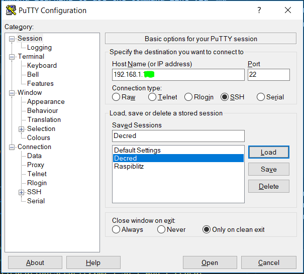
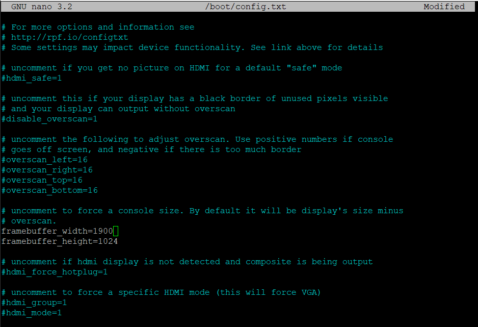

# Running a Decred Raspberry Pi Node

Running a full node is one of the **strongest actions of support** you can do for a peer-to-peer distributed protocol. Every single node that runs on the network adds strength and resilience to the consensus mechanism and is the embodiment of strength in numbers.

At a personal level, running your own node is an excellent way to get hands on with the Decred protocol, Linux and the Raspberry Pi. Its a cheap project with a large impact.


## Purpose of this Guide

This guide will be a no fluff guide on how to setup a raspberry pi Decred full node on a Raspberry Pi from start to finish. Anyone who can operate a Decred wallet is more than capable of setting up a Raspberry Pi DCR node.

Setting up a raspberry pi is well documented elsewhere so I will keep these details brief and focus more on the steps relating to the node setup (although will provide links to help you along the way).

I intend this module to be accessible for all skill levels. As such I use a VNC server (remote Pi desktop) which may help people ease into using SSH only command line. Skill should not prevent anyone running a Decred node!

## Useful References

- [The official Decred documentation]("https://docs.decred.org/wallets/cli/cli-installation/")
- [A full node setup guide by Stakey.club]("https://stakey.club/en/installing-dcrd/")
- [A similar guide by Pablo Labarta]("https://medium.com/crypto-rocket-blog/my-experience-setting-up-a-decred-full-node-8a9bbf55bc30").


## What you will need
- Raspberry Pi 3B+ or better
- Micro USB Power supply and cable
- 16 to 32GB Micro SD card (go for a decent class 10)
- [PuTTy]("https://www.putty.org/") Installed on your Laptop
- [Balena Etcher]("https://www.balena.io/etcher/") installed on your Laptop
- [VNC Viewer]("https://www.realvnc.com/en/connect/download/viewer/") installed on your Laptop


## Step 1 - Installing Raspbian OS
Installing the latest Raspbian operating system is well documented elsewhere on the internet. Your process should be:
1. Download the latest [Raspbian image file]("https://www.raspberrypi.org/downloads/raspbian/")
2. Flash the SD Card using Etcher
3. To set up your Pi headless (without a screen, keyboard and mouse) you will need to [follow the steps here]("https://desertbot.io/blog/headless-raspberry-pi-4-ssh-wifi-setup") to connect the pi to your WiFi and enable SSH. You can also hardwire the pi with an ethernet cable if you have trouble setting up the WiFi.

## Step 2 - Setting up Remote SSH Connection
Here we will establish a remote connection to the pi via SSH using PuTTy.

1. Check the IP address of your raspberry pi. Usually you can check this by logging into your router and looking at the list of clients (if WiFi is setup for your Pi or it is connected via ethernet, the Pi should show up as a client with an assigned IP.)

2. Connect via SSH to your Raspberry pi using PuTTy with this IP address (default settings are fine). Login using the raspberry pi defaults (username = *pi*, password = *raspberry*)

 

3. Run the following commands to update your pi and install VNC Server
```
sudo apt-get update
sudo apt-get upgrade
sudo apt-get install realvnc-vnc-server realvnc-vnc-viewer
```
4.  Harden your Pi. This boosts the security of your pi and makes it much harder for attackers to get in. [This process is covered in depth in this guide]("https://www.raspberrypi.org/documentation/configuration/security.md").

5. Next we will edit the screen resolution settings in this config file so that it appears nicely on a standard Laptop screen when we connect via the VNC server.
```
sudo nano /boot/config.txt
```
6. Edit the lines as shown in the image below (white) by deleting the # and updating the resolution numbers. Hit ```Ctrl + O``` to write out the file and then ```Ctrl + X``` to exit back to console.




7. Next we need to enable VNC on the pi by following the first few steps of [this guide]("https://www.raspberrypi.org/documentation/remote-access/vnc/README.md").

    ```
    sudo raspi-config
    ```
    ```Interfacing Options --> VNC --> YES ```


8. It is worthwhile rebooting your pi at this stage, confirm you can login using your new credentials and changed password and connect both PuTTy SSH and VNC Viewer.

## Step 3 - Download and install dcrinstall
1. Login to your Pi via VNC viewer using the same IP address as you did earlyer for SSH. 

2. Once you have logged into VNC and can see your pi's desktop, navigate to the [dcrinstall github page]("https://github.com/decred/decred-release/releases") and download the latest ARM release.


3. Now that the file has downloaded, it will be located in your home directory ```Downloads``` folder. We will now navigate there via the command line (SSH or using terminal on your pi).

4. We need to set the file to be an executable before we can run it and then we will run the ```dcrinstall``` script. This will initiate the download and install of the required files. (Note, be sure to update the file version as required in the script below)
```
cd ~/Downloads/
chmod u+x dcrinstall-linux-amd64-v1.4.0
./dcrinstall-linux-amd64-v1.4.0
```

6. A folder called ```./decred``` has now been placed in your home directory. It will take a short while (5-10mins) to download and setup all files.

## Step 4 - Get dcrd running
1. Now we navigate to the new decred folder to start up the node deamon.
```
cd
cd ./decred/decred-linux-arm-v1.4.0
./dcrd
```
2. The Decred deamon will boot up and start connecting to peers


3. If you wish to setup a wallet on this node, open up a new version of terminal and run:
```
./dcrwallet --create
```

## Step 5 - Your Decred Node is Now Running!
1. Your node (```dcrd```) is now connecting to new peers and syncing with the blockchain. If you goal is to support the network, your little Pi is now successfully participating in consensus!

2. If you open up a new session of terminal on your Pi, navigate to the ```decred``` installation folder you can run dcrctl to access all functions for your wallet and node
```
cd
cd ./decred/decred-linux-arm-v1.4.0
./dcrctl --help
```
Decred has a [guide for accessing all functions](https://docs.decred.org/wallets/cli/dcrctl-basics/) 

# Closing thoughts


