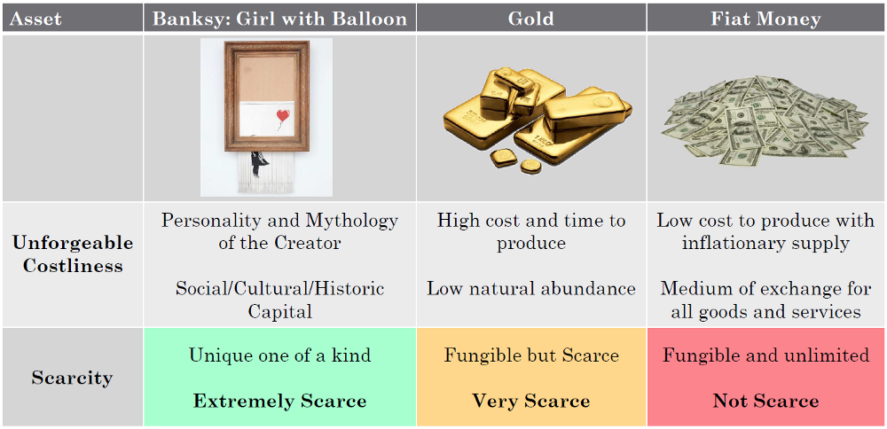
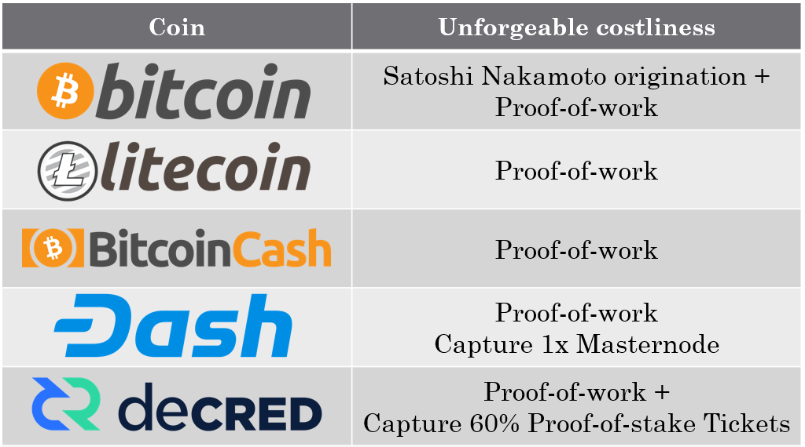
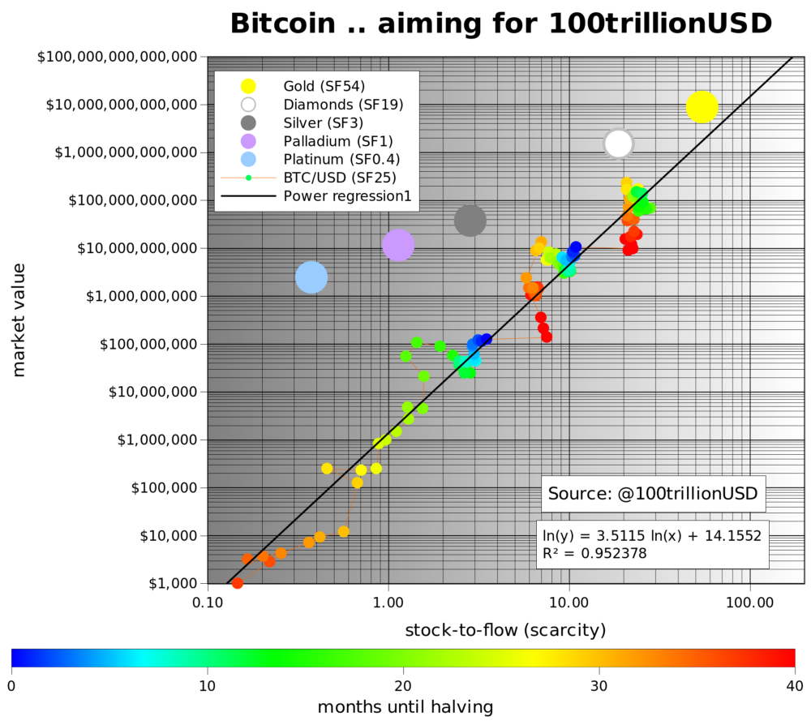
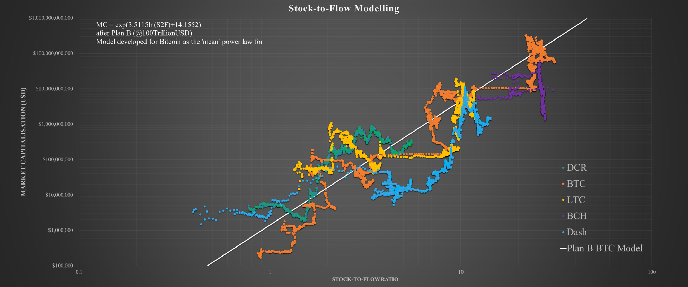
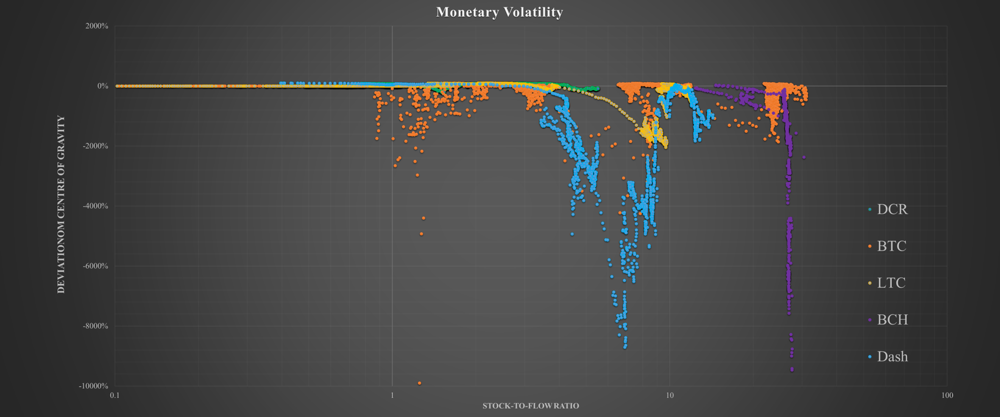
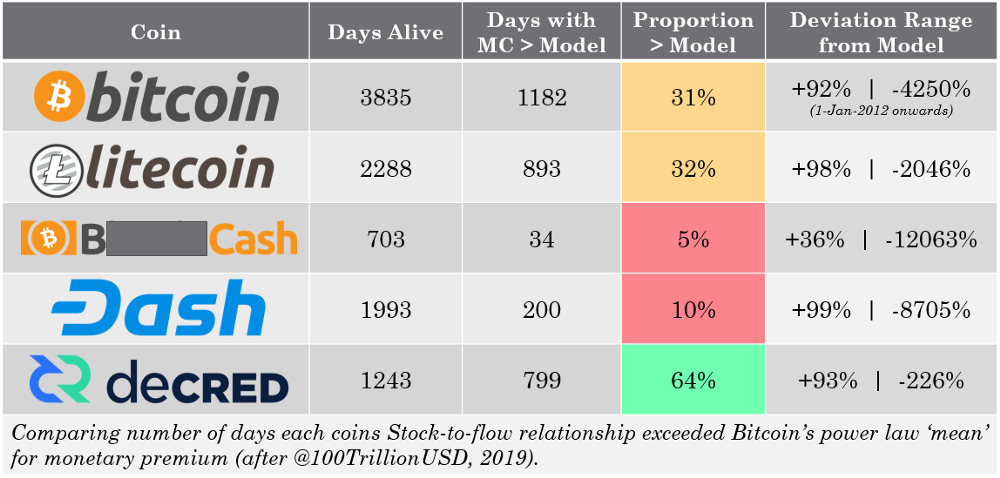

# Monetary Premiums
By Checkmate

*9 July 2019*
## Monetary Premiums, can alt-coins compete with Bitcoin?
The market for fixed supply crypto assets is viciously competitive for altcoins which exist in the shadow of Bitcoin’s commanding reputation, liquidity and market dominance. Bitcoin’s first mover advantage and hardcore monetary policy undoubtedly makes it the front-runner in a new age of digitally native scarce assets.

The question that continues to attract investor attention is whether altcoins with fixed supplies and deterministic supply curves have even a remote chance of competing or co-existing with Bitcoin. Can these assets become sound money, or do they represent a complete misallocation of capital?

In this article, I compare the observable monetary premium of Bitcoin, Litecoin, Bitcoin Cash, Dash and Decred in the context of the stock-to-flow (S2F) relationship developed by PlanB, who’s research based purely on Bitcoins historical data. This relationship model has shown extremely high correlation factors upwards of 95% and with reasonable verification against many sub-sets of Bitcoin data as well as comparison to the uncorrelated precious metals markets.

## Scarcity
The notion of stock-to-flow as a measure of scarcity is a topic of great interest in both the commodities (precious metals in particular) as well as in the fixed supply cryptocurrency markets. Saifedean Ammous explored this concept in great detail considering the historical evolution of money in The Bitcoin Standard, where scarce assets have shown to develop a monetary premium as a result of high stock-to-flow ratio.

Nick Szabo beautifully articulated this idea using the concept of ‘unforgeable costliness’ which describes the unavoidable and expensive costs of production which must exist for an asset to attain a monetary premium.

> "What do antiques, time, and gold have in common? They are costly, due either to their original cost or the improbability of their history , and it is difficult to spoof this costliness” Nick Szabo (2008)

>"Precious metals and collectibles have an unforgeable scarcity due to the costliness of their creation. This once provided money the value of which was largely independent of any trusted third party” Nick Szabo (2005)

# Uuforgeable Costliness
The unforgeable costliness of an object is rooted in the physical cost of production or the improbability of its creation.

Some notable examples of unforgeable costliness are:
* Banksy’s Shredded Girl with Balloon has an underlying character narrative of the artist, social and contextual capital and a one of a kind event during its creation **(Unique)**.
* Establishing and operating a gold mine requires a significant outlay of CAPEX and OPEX costs as well as significant time and human effort required from exploration through to production. Gold as an element is also of low abundance on earth due to its atomic properties **(Very Scarce)**.
* Bitcoin’s proof-of-work ensures that bitcoin issuance is impossible without expending computational resources and electrical demands. The immaculate conception by Satoshi Nakamoto captures the unforgeable characteristics of a Unique origin story as well as the physical costs of mining creating an unparalleled digital scarcity **(Extremely Scarce)**.

An unforgeable costliness is a pre-requisite for establishing a genuine monetary premium as is distinguishes hard money, store of value candidates from those where the supply may be manipulated at low cost to the creator. Fiat currencies have are not considered scarce as supply has no real cap and a centralised authority is able to control the inflation rate at near zero cost.

For crypto-assets, there are a few characteristics which reasonably preclude consideration as a scarce asset due to the ability for an entity to forge the ‘costliness’ of production:

* Centralised coins where control of the maximum supply and/or inflation rate can be manipulated by a discrete number of entities.
* Coins which do not have a hard-coded maximum supply cap and deterministic issuance schedule at the time of creation as this confers monetary authority to a single entity.
* Coins where the issuance via a pre-mined initial coin offering (ICO) puts the cost of creation at effectively zero.
* Coins with security systems that do not require continuous expenditure of electrical energy and computational work (Proof-of-work) otherwise the cost of production is negligible.
* Coins with insufficient security to defend against bad actors attacking the system and minting coins at relatively low expense.

## Selected Alt-coins for Analysis
It is an underlying assumption of this paper that a crypto asset must have an unforgeable costliness of coin production that is at least comparative to that of Bitcoin, given the inability to replicate the Satoshi Nakamoto immaculate conception.

Therefore, to evaluate this problem, I selected the following large cap, fixed supply altcoins which have deterministic issuance schedules to assess if the unforgeable costliness is sufficient to develop a competitive monetary premium. The table below summarises the unforgeable costliness that is required for producing each block (and thus enable the creation of coins).

## Modelling Scarcity Against Market Value
Recently, PlanB completed a number of exceptional studies into the relationship between Bitcoin’s stock-to-flow ratio and the network value (Market Capitalisation). What was established is that a power-law, with a correlation factor in excess of 95%, exists with a reasonable agreement to the precious metal’s markets. Further analysis showed that the model fit was robust enough that taking many sub-sets of Bitcoin’s data (accounting for lost coins, various timescales etc) returned a comparable power law distribution.

These analyses establish confidence that scarcity (as measured by stock-to-flow ratio) strongly influences human perception of value which is subsequently expressed through price.

Power laws are rare but important relationships which often describe natural phenomena such as the distribution of earthquake magnitude against occurrence frequency, variation of planetary orbital speed with distance and the distribution of biological variance. Power laws also appear in many observed distributions in human behaviour, population and demographic densities and even in financial wealth distributions.

## A Natural Phenomenon
Bitcoin is one of the most organic free market assets that the world has ever seen. It has grown from its cypher-punk roots and a market value of exactly zero to a total market value that exceeded $320 Billion in less than 10 years. Bitcoin has attained value because it provides a useful service for people given its soundness as money driven by its and ever-increasing scarcity (rising S2F Ratio).

Its adoption is not mandated, it is freely chosen.

In the age of accessible information, Bitcoin has beautifully captured the attention and investment of millions of people, by choice. Thus, it seems reasonable to assume that Bitcoin has carved out a sort of ‘centre of gravity’ for the relationship between scarcity and human perception of value. Bitcoin may well be a natural phenomenon against which other scarce assets can be compared.

## Alt-coins and Monetary Premiums
The mania phase of the cryptocurrency market in 2017 was largely an unrealistic pursuit for ‘the next Bitcoin’ which is likely to have skewed the valuations of these assets (e.g. hype, liquidity events etc) away from fundamental values. Furthermore, many of these coins do not have a long enough lifespan of data to adequately assess whether a relationship is developing on the basis of the alt-coin data alone.

As such, I do not believe that a sensible, nor organic relationship between S2F and Market Value can be determined for each altcoin using their data in isolation. Plan B identifies this as a low correlation in his discussion with Stephan Livera where attempts to establish a S2F-Value relationship using individual alt-coin data is of low conviction.

However, a position I find more compelling, is undertaking a comparison between the raw S2F vs Market Cap data for each altcoin and Bitcoin’s ‘centre of gravity’. An altcoin which performs favorably relative to Bitcoins power law may well be considered to have an appreciable monetary premium. Conversely, coins that do not perform, I argue, are not favoured by the free market and their unforgeable costliness may be insufficient to support sustained growth in demand.

For this set of fixed supply altcoins, I have established the stock-to-flow ratio over time based on measured supply data as well as the Market capitalisation with data sourced from Coinmetrics.io. Given variable hashrates and other natural anomalies, I have applied a 28-day average to the calculation of stock-to-flow for a cleaner visualisation (which has little distortion to the resulting observations aside from the desired smoothing and horizontal zones of data points at halving events).

What is intriguing with this data set is that it is based purely on the daily calculated issuance rate (projected as constant over 365 days) to determine the S2F ratio and the recorded Market Capitalisation with no additional assumptions applied. A few observations I have determined from this study comparing each coin’s data points and fractals to the ‘centre of gravity’ in white:
* **Bitcoin’s ‘centre of gravity’** does indeed appear to be just that with almost all assets converging or attempting to converge to this trendline throughout their lifespan.
* **Bitcoin** oscillates about the ‘centre of gravity’ with each market cycle and closely matches the line at the time of halving events. The data points are quite organic and rounded in their fluctuations suggesting natural price discovery.
* **Litecoin** also oscillates about this line (albeit with less conviction) and similar to Bitcoin, approaches the ‘centre of gravity’ at halvings. It is worth noting that Litecoin appears much less organic in its performance with more discrete ‘events’ influencing price leading to vertical moves in the data, rather than Bitcoin’s rounded fluctuations.
* **Bitcoin Cash** appears to have suffered the most significant decline in any monetary premium it may have attained and the scatter in S2F suggests instabilities in hash-rate leading to irregular coin issuance.
* **Dash** has a relatively low conviction monetary premium with only a few points where valuation has touched the line. There are also visual outliers in Dash data due to the ~monthly Masternode payout blocks that are smoothed out by the 28-day average. The flow of data points is more cohesive than for BTC, LTC and BCH given the smoother issuance schedule and lack of halvings.
* **Decred** has maintained a monetary premium exceeding the centre of gravity to a greater extent and for a longer time (relative to its lifespan) than any other coin in this study, even Bitcoin. The data appears similarly cohesive due to the smooth issuance curve and through 2019, Decred has hugged the underside of the mean line. This is likely a result of consistent demand for PoS tickets which provide participation rights in the Decred governance system as well as a staking reward. 

## Monetary Volatility
To further formalise these observations, I calculated the number of days that each coin’s market value was above the ‘centre of gravity’ to establish the proportion of its lifespan it has held an exceptional monetary premium. I also look at the maximum and minimum deviation away from this line as gauge for **‘monetary volatility’** or the ability for each coin to maintain its monetary premium over time. This is a similar study to Plan B’s S2F Multiple metric.

**Dash** and **Bitcoin Cash** experience significant downswings away from the mean which indicate an inability to retain a firm monetary premium over time. By far, **Bitcoin Cash** has the poorest behaviour, reaching only 36% growth above the mean, once. It can be argued that, **Bitcoin Cash** may be reasonably discounted as an asset that does not have a monetary premium and is thus unattractive as any form of scarce fixed supply money.

**Bitcoin** and **Litecoin** have seen typical variations from the mean on the order of -1,000% to -2,000% during bear markets and similar to the other coins (excl. Bitcoin Cash) have seen 90%+ upside premiums over the mean line. Given the expected volatility of fixed supply, nascent crypto-assets, I consider this a reasonable benchmark, especially considering Bitcoins.

The standout coin in this study however is **Decred**. Not only has **Decred** retained its monetary premium more than twice as long (relative to lifespan) as **Bitcoin**, it has retained this premium through much of the 2018 bear market with a remarkable maximum negative deviation of only -226%. That is 10x smaller drawdown in monetary premium when compared to Bitcoin with a typical -2000% deviation.

This suggests that **Decred** has attracted the strongest monetary premium of all assets considered in this study. This is a likely result of the underlying demand for proof of stake ticket holders and participation in **Decreds** governance system which is soon to account for 50% of available DCR supply. This is an additional source of validation that ticket demand (and thus demand for ownership and participation in the protocol) is a reliable source of buy support and a strong influence on the perceived scarcity of DCR. 

It is an interesting contrast to **Dash** which utilises a Masternode governance system that requires a lockup of 1000 Dash coins to participate (~$160,000 at time of writing). This may be a significant barrier to entry by the widest cross section of people, especially in comparison to Decred’s ticket system which currently requires around 120-130 DCR ($3,600 - $3,900) with the added ability for ticket splitting for smaller holders. Further research into these mechanism as a driver for coin demand and perceived scarcity may shed light on the difference in performance.

## Concluding Remarks
This study makes the assumption that Bitcoin’s organic growth and high conviction signal have carved out the ‘centre of gravity’ for the relationship between stock-to-flow ratio (scarcity) and human perception of value as expressed through price. Bitcoin should therefore be considered the benchmark against which all crypto assets competing for a monetary premium should be assessed.

The alt-coin mania of 2017 and relatively short lifespan of altcoins is likely to skew data to some extent and thus it is likely that study of each coins S2F-value relationship in isolation is not representative. This assumption must be revisited periodically as additional market cycles play out.

By comparing the data from five large cap fixed supply crypto-assets **Bitcoin, Litecoin, Bitcoin Cash, Dash and Decred**, we can reasonably establish whether an alt-coin monetary premium is developing with respect to Bitcoin’s ‘centre of gravity’.

It is reasonable to conclude that **Bitcoin** has by far the most organic and undeniably important monetary premium, arguably of any financial asset.

Based on this study, **Litecoin** has shown performance similar to Bitcoin however with less conviction and it remains to be seen if it can retain this premium into the future. On this basis, there is little advantage to holding **Litecoin** in place of **Bitcoin** for any purpose other than speculation.

Similarly, I remain hesitant regarding **Dash** as a store of value candidate given the heavy downside swings and overall persistence below the power law mean. Further study into the mechanics of **Dash’** issuance schedule and incentive structure as a driver for scarcity may shed light on this performance.

**Bitcoin Cash** is clearly unable to retain a monetary premium and may be safely disregarded as a monetary asset on the basis of this dataset and analysis. 

**Decred** has shown by far the most interesting and promising performance with a remarkable ability to retain its monetary premium over time. What is most important is that in all metrics assessed in in this study (life above mean and monetary volatility), **Decred** has performed significantly better than Bitcoin itself which is likely of great interest for assessing potential store of value candidates. 

**Decred’s** observable high performance suggests that DCR may be developing a convincing monetary premium and is something that I believe is largely undervalued by the market today. However, given the fundamentals behind Decred are extremely close to those of **Bitcoin**, although with notable areas of differentiation, it is quite likely that DCR will attract substantial interest if this monetary performance continues, liquidity grows and the market catches on. 

## Signature
**Bitcoin**
>

>[3FJaqvbMUTPZ6f7rdca8tifS5PnVDFtN6P](https://blockstream.info/address/3FJaqvbMUTPZ6f7rdca8tifS5PnVDFtN6P)

**Decred**
> 

> [Dsmx4zrTuS6UJxGHNutc5pwH73VHx7JN5XE](https://explorer.dcrdata.org/address/Dsmx4zrTuS6UJxGHNutc5pwH73VHx7JN5XE)

> Signed Message (Article Title): H2GJUDTpW2AHDwjmyH5WJRISN7+SmCe82D0f/lr5pw12FovYlllq4au5LkKqaTpvzj2r/YENGMguYCNBPDYr/wo=

## References
[1]  Modelling Bitcoin’s Value with Scarcity, https://medium.com/@100trillionUSD/modeling-bitcoins-value-with-scarcity-91fa0fc03e25 – Plan B, 2009

[2] Modelling Bitcoins stock-to-flow and other metrics – various charts and analysis, https://twitter.com/100trillionUSD, Plan B, 2019 onwards.

[3] https://unenumerated.blogspot.com/2005/10/antiques-time-gold-and-bit-gold.html — Nick Szabo, 2008

[4] https://nakamotoinstitute.org/bit-gold/— Nick Szabo, 2005

[5] The Bitcoin Standard: The Decentralized Alternative to Central Banking — Saifedean Ammous, 2018

[6] Bitcoin: A Peer-to-Peer Electronic Cash System, Satoshi Nakamoto, 2008

[7] Frontrunning the Bitcoin Halvening, https://twitter.com/stephanlivera/status/1147144702258401280, Stephan Livera Podcast SLP86 with Plan B, 2019

[7] Decred Explorer – Ticket Pool Value, https://explorer.dcrdata.org/charts?chart=ticket-pool-value&zoom=ikd7pc00-jxqrh1c0&bin=day&axis=time
