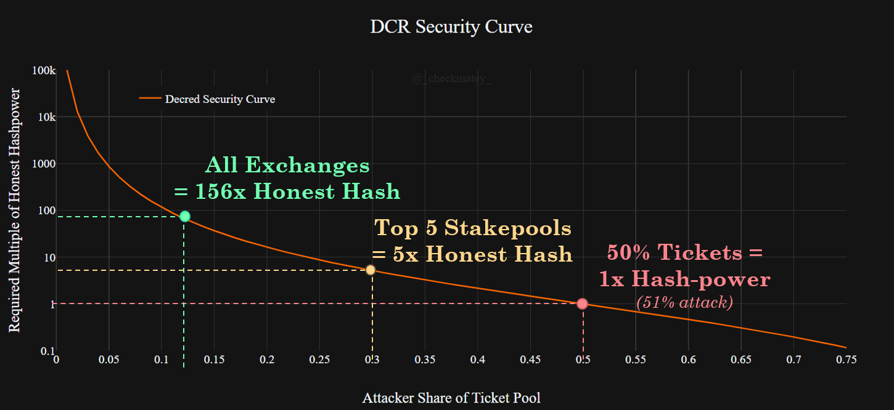
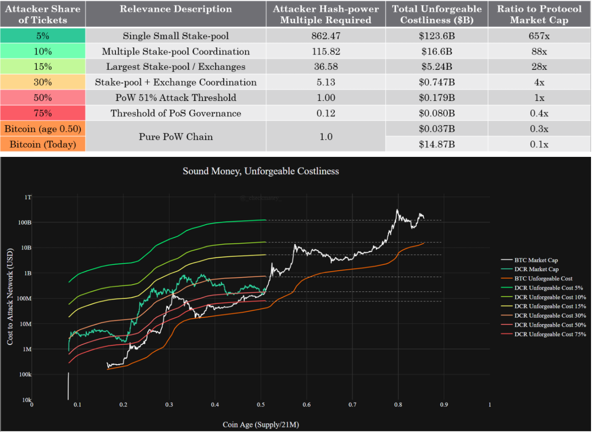
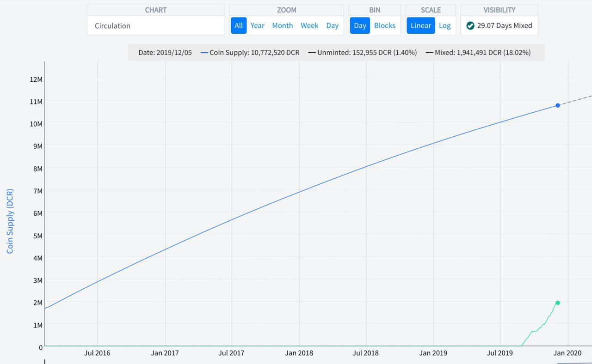

# Our Network - Week 1

## Insight 1 - The Decred Security Curve
The Decred blockchain is secured by a unique Hybrid PoW/PoS consensus mechanism. Each block must be validated by at least 3 out of 5 psuedo-randomly selected PoS tickets. Where a block fails validation, it must be re-mined forfeiting the PoW expendature and block reward. The chart below presents the relative magnitude of honest hashpower required to successfully double spend DCR for a given share of the ticket pool (Y-axis value of 1.0 equates to a standard 51% attack with added cost of holding 50% of tickets).

## Insight 2 - Block Subsidy Models
The Decred protocol issues a block reward split 60% to miners, 30% to ticket holders and 10% to the project treasury. Considered with the hybrid consensus mechanism, Decred functions as a high assurance, triple entry accounting system. @PermabullNino released a paper studying this mechanism via the cummulative block reward paid to the PoW/PoS/Fund split. It revealed strong links between profitability of miners, stakeholders and network value that identify points of support and resistance

## Insight 3 - Miner Squeeze

## Insight 4 - 

## Insight 5 - Privacy Mixing Performance
Decred rolled out the first phase of it's privacy implementation based on the CoinShuffle++ protocol this August. Privacy mixing is integrated with the PoS Ticket system, given tickets are a consistent denomination, constantly in circulation and pseudo-randomly selected to validate. This makes for a strong and large anonymity set. In the four months since launch, over 20% of the DCR supply has participated in privacy mixing.

