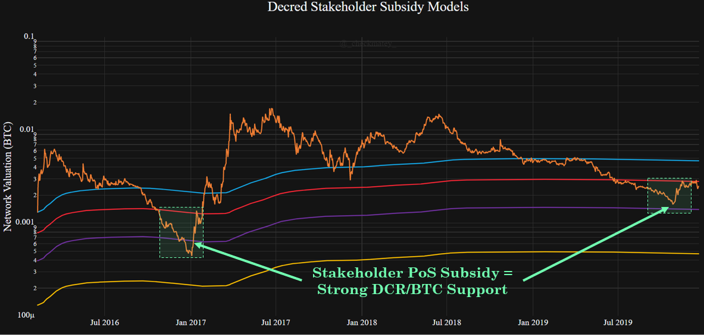
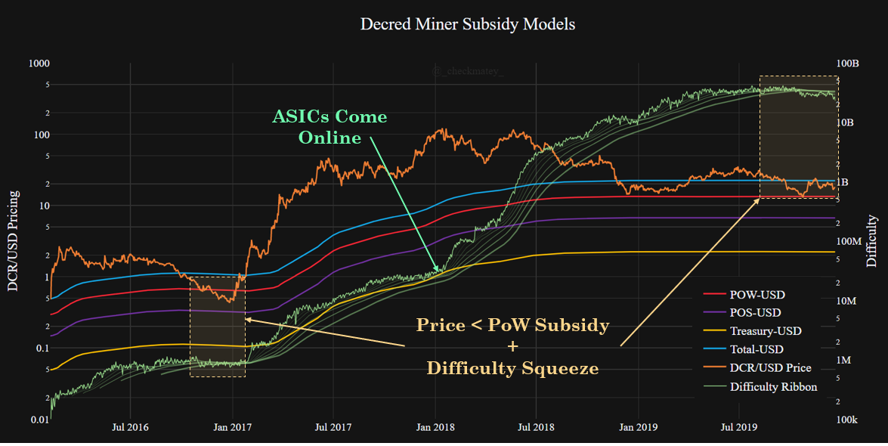
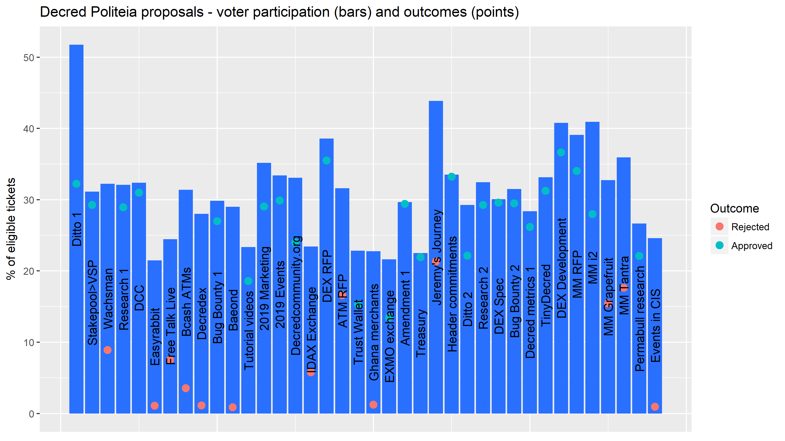

# Our Network - Week 1

## Insight 1 - The Decred Security Curve
The Decred blockchain is secured by a unique Hybrid PoW/PoS consensus mechanism. Each block must be validated by at least 3 out of 5 psuedo-randomly selected PoS tickets. Where a block fails validation, it must be re-mined, forfeiting the PoW expendature and block reward. The chart below presents the relative magnitude of honest hashpower required to successfully double spend DCR for a given share of the ticket pool (Y-axis value of 1.0 equates to a standard 51% attack with added cost of holding 50% of tickets).

## Insight 2 - Block Subsidy Models
The Decred protocol issues a block reward split 60% to miners, 30% to stakeholders and 10% to the project treasury. Considered with the hybrid consensus mechanism, Decred functions as a high assurance, triple entry accounting ledger. @PermabullNino released a paper studying this mechanism via the cummulative block reward paid to the PoW/PoS/Fund split. It revealed strong links between the DCR/BTC Price and investor behaviour where the PoS subsidy (purple) has acted as strong support for trend reversals.

## Insight 3 - Miner Squeeze
Similar to the DCR/BTC price that characterises the investor class, block subsidy models priced in USD are more representative of Miner behaviour. Decred is an ASIC dominated chain and miner costs are denominated in fiat currency. The PoW subsidy line (red) thus indicates when miner profitability is being tested. This was recently confirmed by a squeeze in the difficulty ribbon.

## Insight 4 - A Year of Politeia

Politeia marked a year of use in October, a year in which 38 proposals were put to a vote, of which 25 were approved and 13 rejected. For each proposal, all of the tickets in the live pool when voting starts (~40,960 tickets) have a week to vote Yes or No. The average (mean) participation of eligible tickets was 31.2%, the highest turnout for a proposal was 52% and the lowest 21% (just above the 20% quorum requirement). Many of the proposals to be approved had overwhelming stakeholder support, with 13 of the 25 approved proposals hitting 90%+ approval.

## Insight 5 - Privacy Mixing Performance
Decred rolled out the first phase of it's privacy implementation based on the CoinShuffle++ protocol in August. Privacy mixing has been integrated with the PoS Ticket system to take advantage of consistency in DCR denominations, consistent circulation and pseudo-random selection. This makes for a consistently large and rotating anonymity set. In the four months since launch, over 20% of the DCR supply has participated in privacy mixing.

